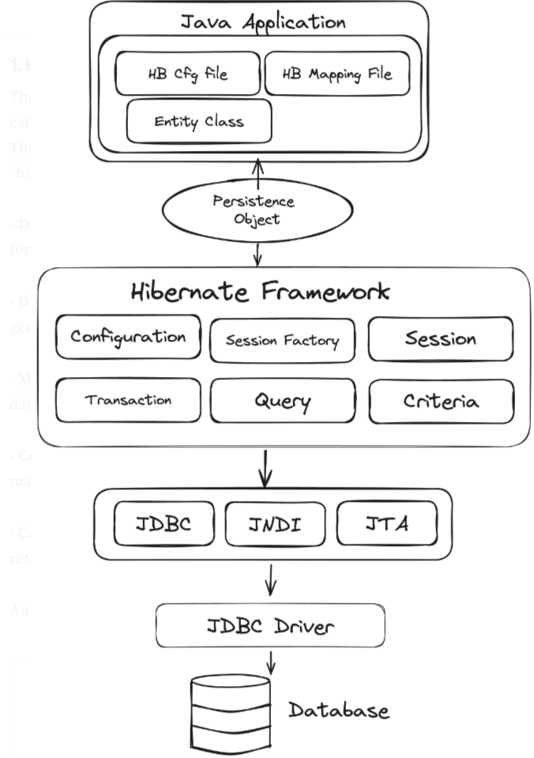

[Hibernate](#hibernate)

[Hibernate Architecture](#hibernate-architecture)

하이버네이트6.6 final 기준

## Hibernate

하이버네이트는 개발자가 SQL 쿼리 대신 자바 코드를 통해 관계형 데이터를 자연스럽고 타입 세이프하게 다룰 수 있도록 ORM 기능을 제공해주는 라이브러리이자 JPA의 구현체임

ORM 목표: 취약하고 타입 세이프하지 않은 코드를 제거하고, 장기적으로 대규모 프로그램을 더 쉽게 유지 관리할 수 있도록 하는 것

Hibernate API는 세 가지 요소로 구성됨
- JPA API 구현 (EntityManagerFactory, EntityManager 인터페이스 및 JPA의 O/R 매핑 어노테이션)
- SessionFactory와 Session을 중심으로 한 하이버네이트 네이티브 API
- 하이버네이트에서 제공하는 매핑 어노테이션

아래의 애플리케이션 코드와 JPA/하이버네이트 ORM 간의 구조를 보면 매핑 어노테이션으로 엔티티 클래스를 나타내고, API를 통해서 퍼시스턴스 작업을 수행함


[출처](https://docs.jboss.org/hibernate/orm/6.6/introduction/html_single/Hibernate_Introduction.html)

퍼시스턴스 작업
- 트랜잭션, 세션 관리
- 하이버네이트 세션을 통한 데이버테이스와의 상호작용
- 필요한 데이터 페치 및 준비
- 실패 처리

## Hibernate Architecture



[출처](https://medium.com/@himani.prasad016/hibernate-architecture-5f78e7e067fe)

### Hibernate Configuration

하이버네이트 설정 및 자바 애플리케이션(커넥션 풀)과 데이터베이스 간의 연결 수행

일반적으로 이런 설정들은 hibernate.cfg.xml 파일에 저장됨

주요 내용
- DB 연결: JDBC URL, username, password 등 DB 연결에 필요한 정보
- 커넥션풀: 커넥션 풀 관련 설정
- Dialect: 특정 database의 SQL 방언을 지정하여 하이버네이트가 적절한 SQL문을 생성할 수 있도록 유도
- 매핑 클래스: 엔티티 클래스 설정
- ddl: 애플리케이션 시작 시 ddl 모드 설정(생성, 업데이트 등)
- 로깅 

### SessionFactory

jakarta.persistence의 EntityManagerFactory를 확장한 인터페이스로, 구현체는 SessionFactoryImpl임

설정 정보를 기반으로 애플리케이션 시작 시 생성되는 객체로 Session 객체 생성 및 관리를 담당함

일반적으로 애플리케이션 전체에서 단 하나의 SessionFactory를 가짐

SessionFactory를 생성하려면 설정 정보를 파싱하고, 커넥션 풀 설정, 다른 초기화 단계 등을 진행하는 무거운 작업을 진행해야 됨

만약 여러 데이터베이스들과 연결이 필요한 경우 각 데이터베이스 당 SessionsFactory를 가질 수 있으나 상당히 고비용 작업을 치뤄야된다는 것에 유의해야 함

```java
EntityManagerFactory sessionFactory = Persistence.createEntityManagerFactory();
EntityManager session = sessionFactory.createEntityManager();
```

### Session

jakarta.persistence의 EntityManager를 확장한 인터페이스로, 구현체는 SessionImpl임

하이버네이트에서 싱글 스레드 작업 유닛을 의미하여, 자바 애플리케이션과 데이터베이스 간의 런타임 인터페이스 역할을 함

persist, merge, find, remove 등의 데이터베이스 작업을 수행할 수 있는 메서드를 제공함

```java
session.persist();
session.remove();
```

### Transaction

jakarta.persistecen의 EntityTransaction을 확장한 인터페이스로, 구현체는 TransactionImpl임

begin, commit, rollback 등 트랜잭션 작업 수행
```java
EntityTransaction transaction = session.getTransaction();

transaction.begin();

...

transaction.commit();
```

### Criteria Queries

하이버네이트에서 여러 조건을 포함하는 복잡한 타입 세이프한 동적 쿼리를 생성하는 방식임

jakarta.persistence.CriteriaQuery를 확장한 JpaCriteriaQuery 인터페이스임

JPQL 쿼리를 문자열로 작성하는 대신, 메서드 호출을 통해 쿼리의 각 부분을 객체로 정의하고 결합하여 작성됨

```java
// Criteria 쿼리를 작성하기 위해 빌더가 필요함
CritetiaBuilder cb = entityManager.getCriteriaBuilder();

// 쿼리의 루트 객체 정의
CriteriaQuery<Book> cq = cb.createQuery(Book.class);

// 조회할 엔티티 지정, FROM 절에 해당
Root<Book> root = cq.from(Book.class);

// 단일 조건 정의, WHERE 절에 해당
Predicate priceCondition = cb.greaterThan(root.get("price"), 15000);
cq.where(priceCondition);

// 쿼리 생성 및 실행
TypedQuery<Book> query = entityManager.createQuery(cq);
List<Book> results = query.getResultList();
```

### HQL (Hibernate Query Language)

하이버네이트에서 제공하는 객체지향 쿼리 언어

자바 문법과 유사한 쿼리를 사용하여 작업을 수행할 수 있음  
  