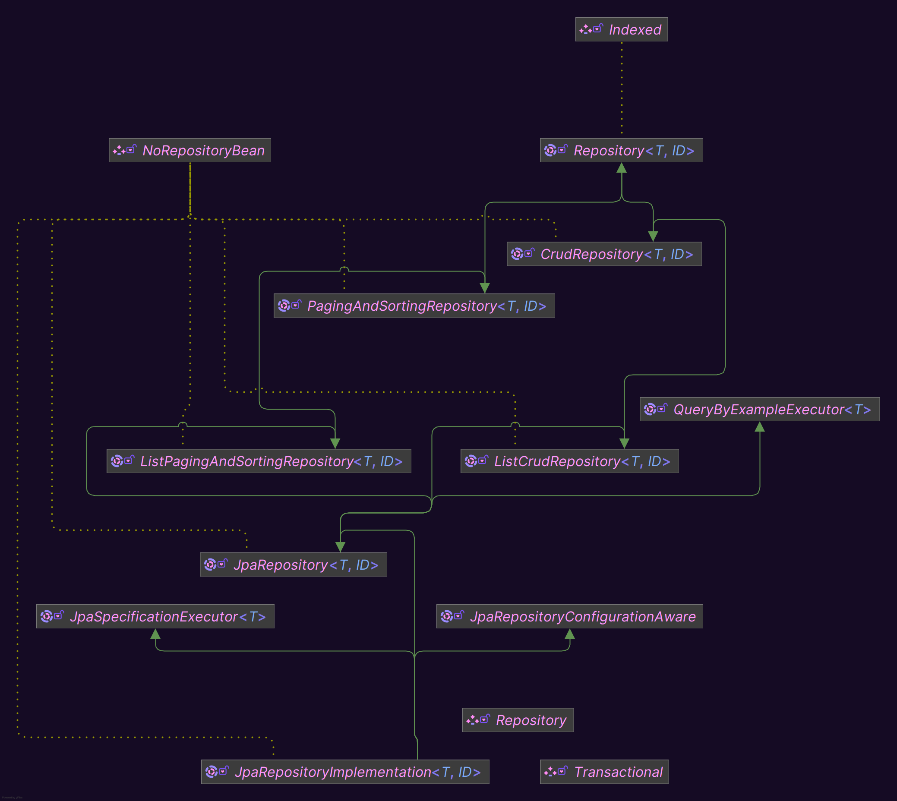
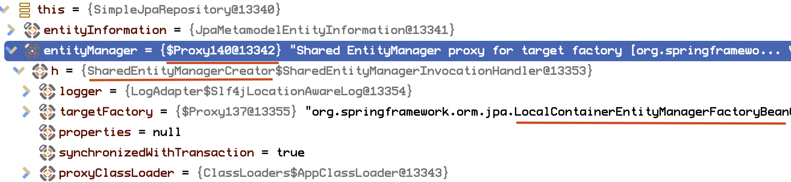
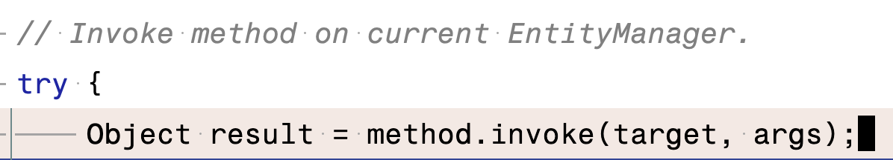
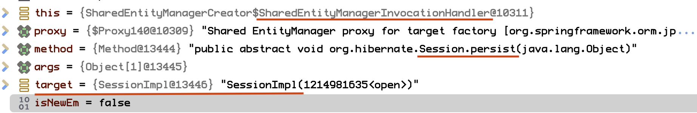

[Spring Data JPA](#spring-data-jpa)

[JpaRepository<T, ID>](#jparepositoryt-id)

[JpaRepositoryImplementation<T, ID>](#jparepositoryimplementationt-id)

[SimpleJpaRepository](#simplejparepository)

- [상속 관계](#상속-관계)
- [생성 과정](#생성-과정)
- [코드 분석](#코드-분석)
  - [필드](#필드)
    - [JpaEntityInformation](#jpaentityinformationt--entityinformation)
    - [EntityManager](#entitymanager-entitymanager)
    - [PersistenceProvider](#persistenceprovider-provider)
    - [CrudMethodMetadata](#crudmethodmetadata-metadata)
    - [ProjectionFactory](#projectionfactory-projectionfactory)
    - [EscapeCharacter](#escapecharacter-escapecharacter--escapecharacterdefault)
  - [메서드](#메서드)
    - [공통](#공통)
    - [조회](#조회)

[Specification](#specification)


## Spring Data JPA

스프링 데이터의 하위 프로젝트로, JPA 데이터 접근을 추상화하여 스프링 데이터 접근 계층에서

Hibernate, EclipseLink 등 JPA 프로바이더를 손쉽게 사용할 수 있음

주요 기능

- Repository 인터페이스 제공
- 메서드 이름 기반의 쿼리 생성
- 페이징 및 정렬 지원
- JPQL 및 네이티브 쿼리 지원
- 동적 쿼리 지원
- Auditing 기능 제공

## JpaRepository<T, ID>

Spring Data JPA에서 제공하는 주요 인터페이스로,

`Repository<T, ID>`, `ListCrudRepository<T, ID>`, `ListPagingAndSortingRepository<T, ID>`, `QueryByExampleExecutor<T>` 를
확장하고, 추가적인 메서드를 제공함

```java

@NoRepositoryBean
public interface JpaRepository<T, ID> extends ListCrudRepository<T, ID>, ListPagingAndSortingRepository<T, ID>, QueryByExampleExecutor<T> {
    /*
        EntityManager의 변경 사항을 데이터베이스에 강제로 동기화(flusH)함
        현재까지의 변경 사항을 즉시 데이터베이스에 반영하고 싶을 때 사용
     */
    void flush();

    // 주어진 엔티티를 저장한 후, 즉시 데이터베이스에 동기화함
    <S extends T> S saveAndFlush(S entity);

    <S extends T> List<S> saveAllAndFlush(Iterable<S> entities);

    /** @deprecated */
    @Deprecated
    default void deleteInBatch(Iterable<T> entities) {
        this.deleteAllInBatch(entities);
    }

    /*
        주어진 엔티티들을 배치로 삭제함
        삭제된 엔티티를 1차 캐시(영속성 컨텍스트)에서 제거하지 않으며, 성능을 위해 데이터베이스에 직접 삭제 명령을 보냄
        대량의 엔티티를 한 번에 삭제하고자 할 때 사용
     */
    void deleteAllInBatch(Iterable<T> entities);

    // ID 컬렉션을 기반으로 배치 삭제
    void deleteAllByIdInBatch(Iterable<ID> ids);

    // 데이터베이스의 모든 엔티티들을 배치로 삭제
    void deleteAllInBatch();

    /** @deprecated */
    @Deprecated
    T getOne(ID id);

    /** @deprecated */
    @Deprecated
    T getById(ID id);

    /*
        주어진 ID에 대한 엔티티의 지연 로딩(Lazy Loading) 참조를 반환함
        데이터베이스 조회를 지연시키고, 엔티티의 참조를 즉시 반환해야 할 때 사용됨
        getOne(), getById() 메서드를 대체함
     */
    T getReferenceById(ID id);

    /*
        Query By Example(QBE) 기능을 사용하여 특정 조건에 맞는 엔티티를 검색하는 메서드
        Example은 엔티티의 예제 인스턴스로, 일치 조건 여부 동적 쿼리를 생성할 때 사용됨 
     */
    <S extends T> List<S> findAll(Example<S> example);

    // 정렬 조건 추가, 지정된 정렬 순서에 따라 결과를 정렬함
    <S extends T> List<S> findAll(Example<S> example, Sort sort);
}
```

## JpaRepositoryImplementation<T, ID>

스프링 데이터 JPA 내부에서 사용되는 인터페이스로, 스프링 데이터 JPA가 런타임에 Repository 인터페이스를 실제 구현체로 생성할 때 필요한 내부 기능을 정의함

JpaRepository 및 동적 쿼리를 생성 및 실행하는 JpaSpecificationExecutor와 스프링 데이터 JPA 내부에서 리포지토리를 설정하는 데 사용되는
JpaRepositoryConfigurationAware를 확장함

```java

@NoRepositoryBean
public interface JpaRepositoryImplementation<T, ID> extends JpaRepository<T, ID>, JpaSpecificationExecutor<T>, JpaRepositoryConfigurationAware {
}
```

## SimpleJpaRepository

스프링 데이터 JPA에서 제공하는 Repository의 기본 구현체임

개발자가 리포지토리 인터페이스를 정의할 때마다, 자동으로 인터페이스의 구현체를 생성해 주는데 이 때 기본적으로 사용되는 구현체가 SimpleJpaRepository임

### 상속 관계



JpaRepositoryImplementation 인터페이스 및 그 상위 인터페이스를 모두 구현하고 있음

JPA를 사용하여 데이터베이스와 상호작용하는 데 필요한 대부분의 표준 메서드들을 구현함

- CRUD 작업
- 페이징
- 정렬
- flush, deleteInBatch() 등

```java

@Repository
@Transactional(
        readOnly = true
)
public class SimpleJpaRepository<T, ID> implements JpaRepositoryImplementation<T, ID> {
    ...
}
```

`@Repository`와 `@Transacitonal`(readOnly) 어노테이션을 적용함

### 생성 과정

리포지토리 인터페이스 정의

- ```java
  public interface UserRepository extends JpaRepository<User, Long> {
    List<User> findByLastName(String lastName);
  }
  ```

애플리케이션 컨텍스트 초기화 및 리포지토리 인터페이스 스캔과 프록시 생성

- 스프링 애플리케이션이 시작될 때, 애플리케이션 컨텍스트가 초기화되면서 스프링 데이터 JPA가 리포지토리 인터페이스들을 스캔함
- 스캔 과정에서 `@EnableJpaRepositories` 어노테이션이 설정된 패키지 내의 모든 리포지토리 인터페이스를 찾음
- 각 리포지토리 인터페이스에 대해 스프링 데이터 JPA는 프록시 객체를 생성함(해당 프록시 객체가 스프링 빈으로 등록됨)
- 이 프록시는 인터페이스를 구현한 동적 프록시로, 실제 구현체로 호출을 위임함

SimpleJpaRepository 생성

- 스프링 데이터 JPA는 [JpaRepositoryFactory](https://docs.spring.io/spring-data/jpa/docs/current/api/org/springframework/data/jpa/repository/support/JpaRepositoryFactory.html)를 사용하여 각 리포지토리 인터페이스의 구현체를 생성함
- JpaRepositoryFactory는 기본적으로 SimpleJpaRepository를 생성함

프록시 객체와 SimpleJpaRepository
- 생성된 프록시 객체는 SimpleJpaRepository의 인스턴스를 호출하도록 구성됨
- 개발자가 사용자 정의 리포지토리 메서드를 호출할 때, 이 호출은 프록시 객체에 의해 가로채어지며 SimpleJpaRepository의 해당 메서드로 위임됨

의존성 주입
- `@Autowired`같은 의존성 주입 방식으로 리포지토리 인터페이스를 주입받을 때, 실제로 주입되는 건 이 리포지토리의 프록시 객체임
- 메서드를 호출하면, 프록시 객체가 받아서 SimpleJpaRepository의 인스턴스로 위임함

### 코드 분석

#### 필드

SimpleJpaRepository의 모든 필드

```java
@Repository
@Transactional(readOnly = true)
public class SimpleJpaRepository<T, ID> implements JpaRepositoryImplementation<T, ID> {
    private static final String ID_MUST_NOT_BE_NULL = "The given id must not be null";

    private final JpaEntityInformation<T, ?> entityInformation;
    private final EntityManager entityManager;
    private final PersistenceProvider provider;

    private @Nullable CrudMethodMetadata metadata;
    private @Nullable ProjectionFactory projectionFactory;
    private EscapeCharacter escapeCharacter = EscapeCharacter.DEFAULT;

    // ...
}
```

##### JpaEntityInformation<T, ?> entityInformation


JPA 엔티티에 대한 메타데이터 정보를 관리하는 역할을 하는 인터페이스임

엔티티 클래스에 대한 다양한 정보를 추상화하여, 엔티티의 식별자(ID) 및 관련 메타데이터를 추출하고 관리하는 데 사용됨

주요 기능

- 엔티티 메타데이터 접근
    - 엔티티의 클래스 타입, ID 속성, 버전 속성
    - 이런 메타데이터는 데이터 접근 계층에서 엔티티와 상호작용할 때 필요함
- 엔티티 ID 정보 제공
    - 엔티티의 식별자 필드(기본 키)에 대한 정보 제공
    - ID 필드 이름, 타입, 값 등
- 엔티티 상태 정보 제공
    - 특정 엔티티 인스턴스가 새로 생성된 건지, 이미 존재하는 건지 확인할 수 있는 메서드 제공

SimpleJpaRepository의 필드에 주입되는 실제 구현체는 `JpaMetaModelEntityInformation` 클래스임


- JPA의 Metamodel API를 통해 엔티티의 메타데이터를 동적으로 분석하여 제공
- 복합 키를 지원하며, 복합 키의 각 속성에 대한 정보 관리

isNew(): 새로 생성된 엔티티인지 판단하는 메서드

isNew 메서드는 JPA 엔티티가 새로 생성된 엔티티인지 (아직 데이터베이스에 저장되지 않은 상태인지) 결정하는 역할을 함

```java
@Override
public boolean isNew(T entity) {

    /*
            1. 버전 속성 존재 여부와 원시 타입 검사(결과에 따라 부모 클래스의 iwNew 호출)
        
            versionAttribute는 JPA 엔티티의 버전 속성을 나타내는 Optional 객체임
            버전 속성은 엔티티의 상태 관리를 위해 사용됨 (엔티티 병합 충돌 감지용)
            만약 엔티티에 버전 속성이 없어서 versionAttribute 비어있다면 부모 클래스(AbstractEntityInformation)의 isNew 호출
            
            버전 속성이 존재하지만, 해당 데이터 타입이 원시 타입(primitive type)인 경우에도 호출
     */
    if (versionAttribute.isEmpty()
            || versionAttribute.map(Attribute::getJavaType).map(Class::isPrimitive).orElse(false)) {
        return super.isNew(entity);
    }

    /*
            2. 버전 속성 존재 시 null 검사
            
            DirectFieldAccessFallbackBeanWrapper는 Spring의 BeanWrapper 인터페이스 구현체로
            객체의 필드에 직접 접근하여 값을 읽고 쓸 수 있게 함
            엔티티 객체의 속성 값을 읽어오기 위해 사용함
     */
    BeanWrapper wrapper = new DirectFieldAccessFallbackBeanWrapper(entity);

    /*
            엔티티의 버전 속성 값이 null이면 엔티티가 데이터베이스에 저장되지 않는 것으로 판단
            null이 아니면 이미 데이터베이스에 저장된 것으로 판단하고 false를 반환
     */
    return versionAttribute.map(it -> wrapper.getPropertyValue(it.getName()) == null).orElse(true);
}
```

JpaMetamodelEntityInformation 부모 클래스의 isNew 메서드 로직

```java
public abstract class AbstractEntityInformation<T, ID> implements EntityInformation<T, ID> {

    public boolean isNew(T entity) {

        // 엔티티 객체의 식별자 필드(ID)와 필드 타입 추출
        ID id = getId(entity);
        Class<ID> idType = getIdType();

        // 해당 필드가 객체 타입인 경우 null 여부에 따라 새로 생성된 엔티티인지 판단
        if (!idType.isPrimitive()) {
            return id == null;
        }

        // Number 타입인 경우 값이 0인지에 따라 새소 생성된 엔티티인지 판단
        if (id instanceof Number) {
            return ((Number) id).longValue() == 0L;
        }

        throw new IllegalArgumentException(String.format("Unsupported primitive id type %s", idType));
    }
}
```

SimpleJpaRepository에서의 사용
- JPA 연산(save, delete) 등을 수행할 때 JpaEntityInformation을 사용하여 엔티티의 상태와 메타데이터를 확인함
  - ```java
    @Override
    @Transactional
    public <S extends T> S save(S entity) {

        Assert.notNull(entity, "Entity must not be null");

        // 새로 생성된 엔티티 경우 persist를 호출하여 데이터베이스에 저장
        if (entityInformation.isNew(entity)) {
            entityManager.persist(entity);
            return entity;
        } else { // 기존 엔티티인 경우 merge를 호출하여 병합
            return entityManager.merge(entity);
        }
    }
    ```
- 복합 키를 가진 엔티티의 경우에도 JpaEntityInformation을 통해 올바르게 ID를 추출하고 관련 작업 수행함

##### EntityManager entityManager

JPA는 자바 진영의 표준 퍼시스턴스 API 명세이고 스프링 데이터 JPA는 스프링 환경에서 JPA를 보다 쉽게 사용할 수 있도록 추상화한 프로젝트임

이런 추상화에 대한 실제 구현은 Hibernate나 EclipseLink 등과 같은 JPA 프로바이더가 담당함(스프링 데이터 JPA의 기본 JPA 프로바이더는 Hibernate)

스프링 데이터 JPA는 JPA의 핵심 인터페이스인 [EntityManager](./jpa.md#entitymanager)를 통해

엔티티 저장/업데이트, JPQL 쿼리 실행, 데이터베이스 트랜잭션 등 데이터베이스와의 상호작용을 수행함

SimpleJpaRepository에서 이 엔티티 매니저를 주입받아서 사용하고 있음
- **EntityManager 하이버네이트 구현체**: SessionImpl 또는 SessionDelegatorBaseImpl

스프링의 엔티티 매니저 및 엔티티 매니저 팩토리 생성 과정
- JPA 설정 파일(persistence.xml) 또는 스프링 JPA 설정(Java Config, application.properties)에서 JPA 구현체와 데이터베이스 연결 정보가 설정됨
- 스프링 데이터 JPA는 `LocalContainerEntityManagerFactoryBean`을 사용하여 JPA의 `EntityManagerFactory` (`SessionFactory`)를 설정하고 관리함
- 스프링 부트는 JPA 자동 구성을 담당하는 HibernateJpaAutoConfiguration(JpaBaseConfiguration)을 통해`LocalContainerEntityManagerFactoryBean`을 빈으로 등록
  - `LocalContainerEntityManagerFactoryBean`이 생성된 EntityManagerFactory에 프록시를 적용하여, 여러 트랜잭션과 스레드 간에 엔티티 매니저 팩토리가 안전하게 공유될 수 있도록 함
- 이외에도 JPA 관련 빈(DataSource, JpaVendorAdapter)들을 등록함

프록시 
- SimpleJpaRepository는 특정 리포지토리 인터페이스의 구현체이지만, 여러 트랜잭션에 대응해서 엔티티 매니저를 다룰 수 있어야 함
- 스프링은 프록시 패턴을 사용해서 엔티티 매니저를 감싸서 관리하는데, 프록시가 실제 인스턴스를 대신하고 트랜잭션의 시작과 종료 시점에 맞춰 실제 인스턴스를 제공하거나 해제함
- 따라서 SimpleJpaRepository의 EntityManager 필드엔 EntityManager를 가지고 있는 프록시가 주입되서 트랜잭션 단위로 EntityManager를 사용할 수 있도록 함
- `SharedEntityManagerCreator`가 트랜잭션 범위 내에서 프록시로 감싸진 EntityManager를 동적으로 바인딩하고 해제하는 역할을 하는데, 트랜잭션이 시작될 때마다 새로운 EntityManager 인스턴스를 가져오거나, 현재 트랜잭션에 바인딩된 EntityManager를 반환함



SimpleJpaRepository에서의 사용
- ```java
  @Override
  @Transactional
  public <S extends T> S save(S entity) {

    Assert.notNull(entity, "Entity must not be null");

    // 새로운 엔티티인 경우 persist 호출
    if (entityInformation.isNew(entity)) {
        entityManager.persist(entity);
        return entity;
    } else { // 아닌 경우 merge 호출
        return entityManager.merge(entity);
    }
  }
  ```
- SimpleJpaRepository에 주입되는 EntityManager는 SharedEntityManagerCreator에서 바인딩한 프록시 객체임
- `entityManager.persist`를 호출하면 실제론 SharedEntityManagerCreator의 중첩 클래스인 SharedEntityManagerInvocationHandler에서 호출을 가로채서 현재 트랜잭션에 바인딩된 실제 엔티티 매니저의 구현체(SessionImpl)에게 위임함
- 경우에 따라서 현재 엔티티 매니저가 없으면 생성해줌
- 
- 

정리
- SimpleJpaRepository는 EntityManager를 통해 데이터베이와 상호작용함
- 하나의 리포지토리 인터페이스 구현체인 SimpleJpaRepository는 여러 스레드에서 수행되는 트랜잭션을 지원해야 됨
- 스프링에선 SharedEntityManagerCreator를 통해 EntityManager를 프록시로 감싸고, 이걸 SimpleJpaRepository에 주입해줌
- EntityManager를 생성하는 EntityManagerFactory는 스프링의 LocalContainerEntityManagerFactoryBean에 의해 관리됨
- LocalContainerEntityManagerFactory는 스프링 부트의 HibernateJpaAutoConfiguration 같은 자동 설정에 의해 스프링 빈으로 등록됨

##### PersistenceProvider provider

PersistenceProvider는 JPA의 특정 구현체(provider)와 관련된 기능을 추상화하여 제공하는 enum 클래스임

JPA는 하이버네이트, 이클립스링크같이 여러 구현체가 존재하며, 각 구현체마다 차이가 있을 수 있음

PersistenceProvider는 특정 구현체에서 제공하는 특화된 기능(표준 JPA API에서 제공하지 않는 기능)을 사용할 수 있도록 함

SimpleJpaRepository에서의 사용
- 카운트 쿼리를 실행하는 count() 메서드에서 각 JPA 구현체별로 카운트 쿼리 스트링이 다를 수 있기 때문에 PersistenceProvider를 통해 카운트 쿼리를 완성함
- ```java
  private String getCountQueryString() {
  
      String countQuery = String.format(COUNT_QUERY_STRING, provider.getCountQueryPlaceholder(), "%s");
      return getQueryString(countQuery, entityInformation.getEntityName());
  }
  
  public enum PersistenceProvider implements QueryExtractor, ProxyIdAccessor, QueryComment {
  
    // 하이버네이트의 경우 '*'을 리턴함
    HIBERNATE(...)  {
      @Override
      public String getCountQueryPlaceholder() {
          return "*";
      }
    }
  }
  ```

##### CrudMethodMetadata metadata

CrudMethodMetadata는 스프링 데이터 JPA 내부에서 사용되는 인터페이스로, 쿼리 힌트(Query Hint)와 잠금 모드(LockModeType) 같은 JPA 리포지토리 메서드와 관련된 메타데이터를 제공함

쿼리 성능 최적화나 동시성 제어를 목적으로 CrudMethodMetadata를 사용함

쿼리 힌트는 특정 JPA 구현체에서 최적화나 특정 기능을 활성하기 위해 사용할 수 있는 힌트이고

잠금 모드는 JPA에서 엔티티를 조회할 때 사용할 잠금 전략을 지정할 수 있음
- 비관적 잠금 (Pessimistic Locking)
- 낙관적 잠금 (Optimistic Locking)

리포지토리 메서드가 실행될 때 CrudMethodMetadata가 제공한 쿼리 힌트나 잠금 모드를 기반으로 EntityManager가 쿼리를 실행함

SimpleJpaRepository에서의 사용
- SimpleJpaRepository의 CrudMethodMetadata는 선택적으로 사용할 수 있는 `@Nullable` 필드임
- findById() 메서드에서 CrudMethodMetadata가 있는 경우 지정된 메타데이터를 활용하여 엔티티를 조회함
- ```java
  @Override
  public Optional<T> findById(ID id) {

      Assert.notNull(id, ID_MUST_NOT_BE_NULL);

      Class<T> domainType = getDomainClass();

      // CrudMethodMetadata 필드가 없는 경우, 일반 조회
      if (metadata == null) {
          return Optional.ofNullable(entityManager.find(domainType, id));
      }

      // CrudMethodMetadata가 있는 경우 잠금 모드와 쿼리 힌트를 가져온 후, 엔티티 조회
      LockModeType type = metadata.getLockModeType();
      Map<String, Object> hints = getHints();

      return Optional.ofNullable(
              type == null ? entityManager.find(domainType, id, hints) : entityManager.find(domainType, id, type, hints));
  }
  ```

##### ProjectionFactory projectionFactory

ProjectionFactory는 스프링 데이터 JPA에서 프로젝션(projection) 인스턴스를 생성하는 인터페이스임

프로젝션은 JPA의 쿼리 결과에서 특정 필드들만 선택적으로 가져와서 특정 데이터 형식(인터페이스나 클래스)에 매핑하여 반환하는 기능으로

두 가지 유형으로 나뉨
- 클로즈드 프로젝션 (Closed Projection)
  - 프로젝션 인터페이스에 정의된 getter를 통해 쿼리 결과 매핑
  - ```java
    // name 필드만 조회하는 프로젝션
    public interface UserNameProjection {
        String getName();
    }
    ```
- 오픈 프로젝션 (Open Projection)
  - 복잡한 표현식을 포함한 프로젝션
  - ```java
    public interface UserSummary {
        String getName();
    
        @Value("#{target.name + ' ' + target.lastName}")
        String getFullName();
    }
    ```

프로젝션 팩토리가 주어진 프로젝션 타입의 인스턴스를 생성하고

스프링 데이터 JPA는 쿼리 결과를 자동으로 해당 인스턴스에 매핑하여 반환함

ProjectionFactory는 CrudMethodMetadata와 마찬가지로 `@Nullable`이 적용된 필드임

##### EscapeCharacter escapeCharacter = EscapeCharacter.DEFAULT

EscapeCharacter는 JPA 쿼리 중 와일드카드 문자나 특수 문자를 처리할 때 사용하는 이스케이프 문자를 나타냄

LIKE 쿼리의 '%', '_' 같은 특수문자 처리가 필요한 경우 사용됨

#### 메서드

##### 공통

###### getDomainClass()

JpaEntityInformation(AbstractEntityInformation)을 통해 엔티티 객체의 클래스 타입을 반환함

```java
protected Class<T> getDomainClass() {
    return entityInformation.getJavaType();
}
```

###### getQuery(Specification<T>, Sort) 


```java
protected TypedQuery<T> getQuery(@Nullable Specification<T> spec, Sort sort) {
    return getQuery(spec, getDomainClass(), sort);
}
```

###### getQuery(Specification<T>, Class<S>, Sort)

```java
protected <S extends T> TypedQuery<S> getQuery(@Nullable Specification<S> spec, Class<S> domainClass, Sort sort) {

  CriteriaBuilder builder = entityManager.getCriteriaBuilder();
  CriteriaQuery<S> query = builder.createQuery(domainClass);

  Root<S> root = applySpecificationToCriteria(spec, domainClass, query);
  query.select(root);

  if (sort.isSorted()) {
    query.orderBy(toOrders(sort, root, builder));
  }

  return applyRepositoryMethodMetadata(entityManager.createQuery(query));
}
```

##### 조회

###### findById(ID)

리포지토리 인터페이스에 지정한 ID를 기반으로 한 개의 엔티티를 조회하는 메서드

```java
@Override
public Optional<T> findById(ID id) {

    Assert.notNull(id, ID_MUST_NOT_BE_NULL);

    // 엔티티 타입 추출
    Class<T> domainType = getDomainClass();

    // 메타데이터가 없는 경우 일반 조회
    if (metadata == null) {
        return Optional.ofNullable(entityManager.find(domainType, id));
    }

    // 있는 경우 잠금 모드와 쿼리 힌트 추출
    LockModeType type = metadata.getLockModeType();
    Map<String, Object> hints = getHints();

    // 잠금 모드와 쿼리 힌트를 사용한 엔티티 조회
    return Optional.ofNullable(
            type == null ? entityManager.find(domainType, id, hints) : entityManager.find(domainType, id, type, hints));
}
```

###### findAllById(Iterable<ID>)

리포지토리 인터페이스에 지정한 ID를 기반으로 여러 개의 엔티티를 조회하는 메서드

엔티티의 기본 키 유형(복합 키, 단일 키)에 따라 동작 방식이 다름
- 복합 키인 경우: 주어진 ID 값들로 개별 조회 수행
- 단일 키인 경우: 단일 쿼리로 여러 엔티티 조회

```java
@Override
public List<T> findAllById(Iterable<ID> ids) {

    // 예외 메시지 대신 직접 String 값을 사용함
    Assert.notNull(ids, "Ids must not be null");

    // 주어진 ID 값들이 비어있는 경우 메서드를 실행하지 않고 빈 컬렉션 반환
    if (!ids.iterator().hasNext()) {
        return Collections.emptyList();
    }

    /*
        엔티티의 식별자 필드가 복합 키로 구성된 경우
        루프문을 돌아서 findById()를 호출해서 각 ID에 대해 개별적으로 엔티티를 조회하여 결과를 누적한 뒤 반환
        복합 키를 단일 쿼리로 여러 엔티티를 조회하는 게 복잡하기 때문에 개별 조회 수행
     */
    if (entityInformation.hasCompositeId()) {

        List<T> results = new ArrayList<>();

        for (ID id : ids) {
            findById(id).ifPresent(results::add);
        }

        return results;
    }

    /*
        단일 기본 키인 경우 여러 ID에 대한 단일 쿼리를 동적으로 생성해서 엔티티들을 조회함
     */
    Collection<ID> idCollection = toCollection(ids);

    // 동적 쿼리 생성
    ByIdsSpecification<T> specification = new ByIdsSpecification<>(entityInformation);
    TypedQuery<T> query = getQuery(specification, Sort.unsorted());

    // setParameter 메서드를 통해 idCollection 바인딩 후 쿼리 실행 및 결과 반환
    return query.setParameter(specification.parameter, idCollection).getResultList();
}
```

###### findAll()

```java
@Override
public List<T> findAll() {
    return getQuery(null, Sort.unsorted()).getResultList();
}
```

## PlatformTransactionManager

## JpaTransactionManager

## TransactionSynchronizationManager

## @Transaction

## @Transactional

## Query Method

## Projections

## Specification

Specification은 복잡한 쿼리나 런타임에 쿼리 조건이 결정되는 동적 쿼리를 JPA의 Criteria API를 활용하여 생성할 수 있도록 도와주는 인터페이스임  

### 특징

동적 쿼리 생성
- 애플리케이션 런타임에 조건을 추가하거나 제거할 수 있음 
- NOT, WHERE, AND, OR 같은 조건 연산자 결합

타입 세이프
- JPA Criteria API를 사용하므로, 쿼리 작성 시 타입 안전성 보장
- 쿼리의 각 부분이 메타모델을 사용하여 정의됨 - 컴파일 시점에 오류 감지 가능

### 추상 메서드

주어진 root(기본 엔티티 타입)와 CriteriaQuery에 대해 Predicate 형식으로 엔티티 쿼리의 WHERE 절을 만드는 메서드임

```java
@Nullable
Predicate toPredicate(Root<T> root, @Nullable CriteriaQuery<?> query, CriteriaBuilder criteriaBuilder);
```

### 예시

#### 엔티티 정의 

```java
@Entity
public class User {
    @Id
    @GeneratedValue
    private Long id;
    private String firstName;
    private String lastName;
    private int age;

    // Getters and Setters
}
```

#### Specification 정의 및 사용

동적 쿼리 조건 정의

hasLastName 메서드는 주어진 string 값을 가진 엔티티가 있는지 확인하는 동적 쿼리를 반환하고

hasAgeGreaterThan 메서드는 주어진 int 값보다 큰 값을 가진 엔티티가 있는지 필터링하는 동적 쿼리를 반환함 

```java
public class UserSpecification {
    
    public static Specification<User> hasLastName(String lastName) {
        return (root, query, builder) -> 
                builder.equal(root.get("lastName"), lastName);
    }

    public static Specification<User> hasAgeGreaterThan(int age) {
      return (root, query, builder) ->
              builder.greaterThan(root.get("age"), age);
    }
} 
```

리포지토리 인터페이스 정의

JpaSpecificationExecutor 확장 필요

```java
public interface SpecUserRepository extends JpaRepository<SpecUser, Long>, JpaSpecificationExecutor<SpecUser> {
}
```

서비스 객체의 비즈니스 로직에서 정의한 Specifiaction 사용

```java
public List<SpecUser> findUsers(String lastName, int age) {
    Specification<SpecUser> spec = Specification
            .where(SpecUserSpecification.hasLastName(lastName))
            .and(SpecUserSpecification.hasAgeGreaterThan(age));

    return specUserRepository.findAll(spec);
}
```

## Locking

## Auditing

## Custom Repository

## Publishing Domain Events

## Repository Query Keyword

## Repository Return type