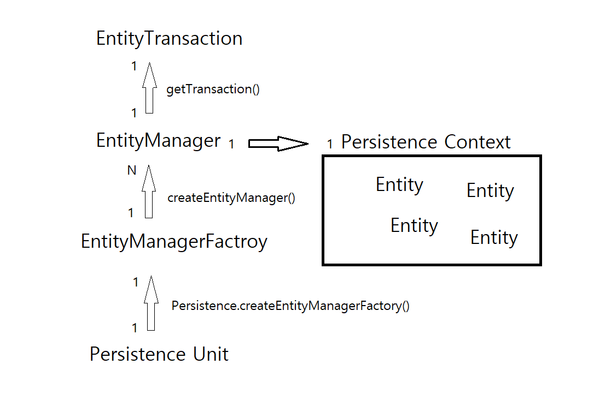

[JPA](#jpa)
- [패러다임 불일치](#패러다임-불일치)
- [ORM](#orm)
- [JPA 주요 기능](#jpa-주요-기능)
- [JPA 아키텍처](#jpa-아키텍처)
- [영속성 컨텍스트와 엔티티](#영속성-컨텍스트와-엔티티)
- [트랜잭션에 따른 영속성 컨텍스트 생명주기](#트랜잭션에-따른-영속성-컨텍스트-생명주기)

[jakarta.persistence 패키지](#jakartapersistence-패키지)
- [인터페이스](#인터페이스)
  - [EntityManager](#entitymanager)
  - [EntityManagerFactory](#entitymanagerfactory)
  - [Persistence](#persistence)
  - [EntityTransaction](#entitytransaction)
- [어노테이션](#어노테이션)
  - [엔티티 정의, 매핑 어노테이션](#엔티티-정의-매핑-어노테이션)
  - [관계 매핑 어노테이션](#관계-매핑-어노테이션)
  - [콜백 메서드, 이벤트 리스너 어노테이션](#콜백-메서드-이벤트-리스너-어노테이션)
- [쿼리](#쿼리)
  - [Query](#query)
  - [TypedQuery](#typedquery)
- [LockModeType, FlushModeType](#lockmodetype-flushmodetype)

## JPA

JPA(Java Persistence API)는 자바 애플리케이션에서 객체 지향 프로그래밍과 관계형 데이터베이스 간의 패러다임 불일치 문제를 해결하기 위한 표준 명세임

패러다임 불일치: 객체 지향 언어에서 사용하는 **객체 모델**과 관계형 데이터베이스에서 사용하는 **테이블 모델** 간의 차이

## 패러다임 불일치

**객체와 테이블의 불일치**

자바의 데이터 표현 방법: 객체(필드와 메서드)

관계형 데이터베이스 데이터 표현 방법: 테이블(행과 열)

**데이터 간 연관 관계**

자바 객체 사이에는 참조(Association), 집합(Composition), 상속(Inheritance) 등의 관계가 있는 반면,

관계형 데이터베이스에서는 이러한 관계를 외래 키나 조인으로 처리해야 됨

또한 상속의 개념이 없어서 테이블 구조로 표현하기 어려움

**객체 식별**

객체는 메모리에서 유일한 참조를 통해 식별되지만, 데이터베이스에서는 기본 키를 사용하여 식별함

## ORM

Object-Relational Mapping의 약자로, 애플리케이션에서 데이터베이스 영속성 작업을 객체지향적으로 수행할 수 있도록 도와주는 기술임

JPA는 객체지향 프로그래밍과 관계형 데이터베이스 간의 패러다임 불일치 문제를 해결하는 자바 진영 ORM 표준 명세임

## JPA 주요 기능

### 객체와 테이블 매핑

JPA는 자바 객체를 데이터베이스 테이블에 매핑하여, 자바 코드로 데이터베이스의 데이터를 쉽게 다룰 수 있도록 함

자바 클래스 - 데이터베이스의 테이블

필드 - 테이블 컬럼

### CRUD 기능

JPA를 통해 자바 코드로 데이터베이스의 CRUD 작업을 쉽게 수행 가능

### 캐싱

JPA는 1차 캐시 등을 통해 데이터베이스 접근을 줄이고 성능을 향상 시킴

### 트랜잭션 관리

데이터베이스 트랜잭션을 자바 코드로 관리할 수 있게 해줌

### JPQL

JPA는 SQL이 아닌, 객체 지향적으로 데이터를 질의할 수 있는 JPQL(Java Persistence Query Language)을 제공함

이를 통해 자바 코드에서 직접 SQL을 작성하지 않고도 데이터베이스와 상호작용을 할 수 있음

## JPA 아키텍처




엔티티 매니저는 데이터베이스와 상호작용하며 영속성 컨텍스트를 관리하는 객체임

엔티티의 생명 주기를 관리하고 데이터베이스와의 CRUD 작업을 수행함

하나의 엔티티 매니저는 하나의 영속성 컨텍스트를 가짐

즉, 엔티티 매니저가 생성될 때 내부적으로 영속성 컨텍스트도 함께 생성됨

## 영속성 컨텍스트와 엔티티

특정 엔티티 매니저가 관리하는 엔티티 객체들의 모임을 영속성 컨텍스트라고 함

메모리 상에 존재하는 엔티티 객체를 관리하는 일종의 캐시임

### 영속성 컨텍스트의 주요 기능

#### 트랜잭션 내 관련된 모든 엔티티 객체 상태 추적 및 관리(추가/수정/삭제)

엔티티의 상태를 크게 네 가지로 구분해서 관리함


- 비영속(new/transient): 영속성 컨텍스트가 관리하지 않는 상태로, 데이터베이스와 연관되지 않은 상태
- 영속(managed/persistent): 영속성 컨텍스트가 관리하는 상태로, 데이터베이스와 연관되어 있는 상태
- 준영속(detached): 한 때 영속 상태였지만, 현재는 영속성 컨텍스트가 관리하지 않는 상태
- 삭제(removed): 영속성 컨텍스트에 의해 삭제가 예약된 상태

#### 변경 감지(dirty-checking)

영속성 컨텍스트는 트랜잭션 커밋 전 엔티티의 속성 값 변경을 감지하여 데이터베이스에 변경사항을 반영함 

#### 쓰기 지연(white-behind)

JPA는 엔티티의 변경 작업을 즉시 데이터베이스에 반영하지 않고, 트랜잭션이 커밋되는 시점에 한꺼번에 처리하는 방식으로 최적화를 함

이를 쓰기 지연이라고 하는데, 이를 통해 여러 변경 작업을 하나의 SQL로 묶어 실행할 수 있어 성능을 높임

#### 엔티티 동일성 보장

영속성 컨텍스트는 동일한 트랜잭션 내에서 같은 데이터베이스 레코드를 참조하는 경우, 동일한 엔티티 객체를 반환함

이를 통해 엔티티 객체의 동일성을 보장하고, 데이터의 일관성을 유지할 수 있음

#### 데이터베이스와 동기화 작업 수행

#### 엔티티 객체의 삽입(persist), 수정(merge), 삭제(remove), 조회(find) 작업 관리

### 트랜잭션에 따른 영속성 컨텍스트 생명주기

영속성 컨텍스트는 보통 트랜잭션 단위로 관리됨

트랜잭션이 진행되는 동안 엔티티 매니저를 사용해 엔티티를 조회하거나 수정할 수 있음

이 때 조회된 엔티티는 영속성 컨텍스트에 저장되고, 이후 동일한 트랜잭션 내에서 다시 조회되면 데이터베이스에서 가져오는 대신 영속성 컨텍스트에서 반환됨 (1차 캐시)

영속성 컨텍스트는 트랜잭션 내 관리하고 있는 엔티티의 속성 값 상태 변화 감지하여 트랜잭션 커밋 시 데이터베이스에 변경사항을 반영함

#### 트랜잭션 시작 시

트랜잭션이 시작되면 엔티티 매니저가 활성화되고, 이와 함께 영속성 컨텍스트도 초기화됨

엔티티 매니저는 영속성 컨텍스트를 통해 엔티티를 관리함

#### 트랜잭션 커밋 시

트랜잭션이 커밋되면 영속성 컨텍스트에 있는 모든 변경 사항을 데이터베이스에 반영함

#### 트랜잭션 롤백 시

트랜잭션이 롤백되면 영속성 컨텍스트에 있는 모든 변경 사항이 무효화됨

영속성 컨텍스트에 있던 엔티티의 상태를 초기 상태로 복원함

#### 트랜잭션 종료 후

트랜잭션이 종료되면, 영속성 컨텍스트는 비워지거나 폐기됨

엔티티 매니저는 더 이상 이전의 영속성 컨텍스트를 사용할 수 없으며, 새로운 트랜잭션이 시작되면 새로운 영속성 컨텍스트가 생성됨

## jakarta.persistence 패키지

JPA 표준 명세를 제공하는 핵심 패키지로, JPA 기능을 사용하기 위한 여러 가지 어노테이션과 인터페이스를 포함함

### 인터페이스

#### EntityManager

JPA의 핵심 인터페이스로, 데이터베이스 관리 및 엔티티 객체의 생명주기를 관리함

엔티티 매니저 인스턴스는 엔티티의 상태를 관리하는 일종의 1차 캐시로 동작하는 영속성 컨텍스트와 연결됨

데이터베이스와 동기화하거나 엔티티의 상태 변화를 추적하며 다음과 같은 주요 기능을 수행함
- 엔티티 저장, 조회 수정, 삭제 작업
- JPQL 또는 네이티브 SQL을 사용한 쿼리 실행
- 트랜잭션 관리(`EntityTransaction`)

```java
public interface EntityManager extends AutoCloseable {}

public interface AutoCloseable {
    void close();
}
```

EntityManager는 AutoCloseable 인터페이스를 확장하는데, AutoCloseable을 구현한 객체는 try-wich-resources 블록 안에서 선언될 때

블록이 끝나면 자동으로 close() 메서드가 호출되어 리소스를 정리함

```java
public interface EntityManager extends AutoCloseable {

    /* ------------ 엔티티 관련  ------------- */
    
    public void persist(Object entity);
    
    public <T> T merge(T entity);
    
    public void remove(Object entity);
    
    public <T> T find(Class<T> entityClass, Object primaryKey);
    
    public <T> T getReference(Class<T> entityClass, Object primaryKey);

    public void detach(Object entity);

    public boolean contains(Object entity);

    /* ------------ 영속성 컨텍스트 관련  ------------- */
    
    public void flush();
    
    public void lock(Object entity, LockModeType lockMode);
    
    public void refresh(Object entity);

    public boolean isOpen();
    
    public void clear();
    
    /* ------------ 쿼리 관련 ------------- */
    
    public Query createQuery(String sqlString);
    
    public <T> TypedQuery<T> createQuery(CreteriaQuery<T> creteriaQuery);
    
    public Query createNamedQuery(String name);
    
    public <T> TypedQuery<T> createNamedQuery(String name, Class<T> resultClass);
    
    public Query createNativeQuery(String sqlString);

    public StoredProcedureQuery createNamedStoredProcedureQuery(String name);

    public CriteriaBuilder getCriteriaBuilder();

    /* ------------ 트랜잭션 관련 ------------- */
  
    public void joinTransaction();
    
    public boolean isJoinedToTransaction();
    
    public EntityTransaction getTransaction();

    /* ------------ 엔티티 그래프 관련 ------------- */
      
    public <T> EntityGraph<T> createEntityGraph(Class<T> rootType);

    public EntityGraph<?> createEntityGraph(String graphName);

    public  EntityGraph<?> getEntityGraph(String graphName);

    public <T> List<EntityGraph<? super T>> getEntityGraphs(Class<T> entityClass);
}
```

#### EntityManagerFactory

EntityManager 인스턴스를 생성하는 인터페이스로, 데이터베이스와의 상호작용을 관리하며 엔티티 매니저의 생명 주기를 제어함

엔티티 매니저 팩토리는 애플리케이션 전체에서 하나만 생성되고

엔티티 매니저는 필요할 때마다 엔티티 매니저 팩토리에 의해 생성됨

**주요 역할**
- 엔티티 매니저 관리
- 캐시 관리: 2차 캐시 관리, 여러 엔티티 매니저가 공유할 수 있는 글로벌 캐시 제공
- 리소스 관리: 데이터베이스 연결 관리, 캐시 정리 등

```java
public interface EntityManagerFactory extends AutoCloseable {
    
    // 엔티티 매니저 생성
    EntityManager createEntityManager();

    CriteriaBuilder getCriteriaBuilder();

    Metamodel getMetamodel();

    boolean isOpen();
    void close();
    
    Cache getCache();

    void addNamedQuery(String name, Query query);

    <T> void addNamedEntityGraph(String graphName, EntityGraph<T> entityGraph);
}
```

#### Persistence

persistence.xml 파일을 통해 EntityManagerFactory를 생성하는 유틸리티 클래스

#### @PersistenceContext

엔티티 매니저를 주입받을 때 사용하는 어노테이션

#### EntityTransaction

JPA에서 트랜잭션을 관리하기 위한 인터페이스

```java
public interface EntityTransaction {
    void begin();

    void commit();

    void rollback();

    void setRollbackOnly();

    boolean getRollbackOnly();

    boolean isActive();
}
```

### 어노테이션

#### 엔티티 정의, 매핑 어노테이션

`@Entity`: 클래스가 JPA 엔티티임을 나타내며 데이터베이스의 테이블과 매핑됨

`@Table`: 엔티티 클래스가 매핑될 데이터베이스 테이블을 지정함 (테이블 이름, 스키마 등 지정)

`@Id`: 엔티티의 기본 키를 나타내며 데이터베이스의 기본 키에 해당하는 필드에 적용됨

`@GeneratedValue`: 기본 키 생성 전략을 지정함
- `GenerationType`: 기본 키 생성 전략 유형(TABLE, SEQUENCE, IDENTITY, UUID, AUTO)

`@Column`: 엔티티 필드가 데이터베이스의 컬럼에 매핑됨을 나타냄 (컬럼의 이름, 길이, 널 여부 등 지정)

`@Embedded`: 임베디드 타입 클래스를 정의할 때 사용됨

`@Embeddable`: 임베디드 타입 클래스를 엔티티 필드에 선언할 때 사용됨

`@MappedSuperclass`: 공통적으로 사용하는 매핑 정보를 상속하기 위한 슈퍼 클래스임을 나타냄, 직접 테이블과 매핑되지 않지만 이를 상속받는 서브 클래스들이 테이블과 매핑됨

`@Inheritance`: 엔티티 상속 전략을 지정함
- `InheritanceType`: 엔티티 상속 전략 유형(SINGLE_TABLE, TABLE_PER_CLASS, JOINED)

`@Enumerated`: Enum 타입을 데이터베이스에 저장할 떄 사용됨 (ORDINAL, STRING 방식 중 선택)

`@Lob`: 대형 객체(Large Object) 타입을 매핑할 때 사용됨, BLOG(Binary Large Object) 또는 CLOB(Character Large Object)로 저장됨

`@Transient`: 특정 필드를 영속성 컨텍스트에 포함하지 않도록 지정함, 데이터베이스 컬럼으로 매핑되지 않음

`@Cacheable`: 엔티티가 2차 캐시를 사용할 수 있음을 나타냄 (엔티티를 캐시할지 여부 결정)

`@Cache`: 캐시의 속성 정의 (캐시를 사용하는 방법과 캐시 속성 정의)

#### 관계 매핑 어노테이션

`@ManyToOne`: 다대일 관계 매핑

`@OneToMany`: 일대다 관계 매핑

`@ManyToMany`: 다대다 관계 매핑

`@JoinTable`: 다대다 관계에서 조인 테이블을 정의할 때 사용

`@JoinColumn`: 외래 키 매핑, 관계를 정의하는 필드에 적용함

`@CascadeType`: 관계 엔티티에서 영속성 전이(cascade)를 정의할 때 사용(ALL, PERSIST, MERGE, REMOVE, REFRESH, DETACH)

#### 쿼리 어노테이션

`@NamedQuery`: 이름이 지정된 정적 쿼리를 정의함, 엔티티 클래스에 미리 정의된 JPQL 쿼리를 사용할 수 있음

`@NamedQueries`: 여러 개의 이름이 지정된 쿼리를 정의할 때 사용됨

### 콜백 메서드, 이벤트 리스너 어노테이션

`@PrePersist`: 엔티티가 저장되기 전에 호출될 메서드에 선언함

`@PostPersist`: 엔티티가 저장된 후에 호출될 메서드에 선언함

`@PreUpdate`: 엔티티가 업데이트되기 전에 호출될 메서드에 선언함

`@PostUpdate`: 엔티티가 업데이트된 후에 호출될 메서드에 선언함

`@PreRemove`: 엔티티가 삭제되기 전에 호출될 메서드에 선언함

`@PostRemove`: 엔티티가 삭제된 후에 호출될 메서드에 선언함

`@PostLoad`: 엔티티가 로드된 후에 호출될 메서드에 선언함

### 쿼리

#### Query

일반적인 JPQL 쿼리 인터페이스로 JPQL 또는 네이티브 SQL을 사용해 데이터베이스의 다양한 쿼리를 실행할 수 있음

엔티티 매니저를 통해 생성됨

#### TypedQuery

타입이 지정된 쿼리(타입 세이프)를 실행할 때 사용되는 인터페이스로 제네릭을 지원함

결과를 특정 타입으로 받을 수 있음

`@QueryHint`: 쿼리 실행에 대한 힌드 제공, 성능 최적화나 캐시 사용 여부 등을 정의할 수 있음

### LockModeType, FlushModeType

#### LockModeType

엔티티에 대한 락 모드를 정의함
- READ
- WRITE
- OPTIMISTIC
- OPTIMISTIC_FORCE_INCREMENT
- PESSIMISTIC_READ
- PESSIMISTIC_WRITE
- PESSIMISTIC_FORCE_INCREMENT
- NONE

#### FlushModeType

영속성 컨텍스트의 플러시 모드를 설정함
- AUTO
- COMMIT

