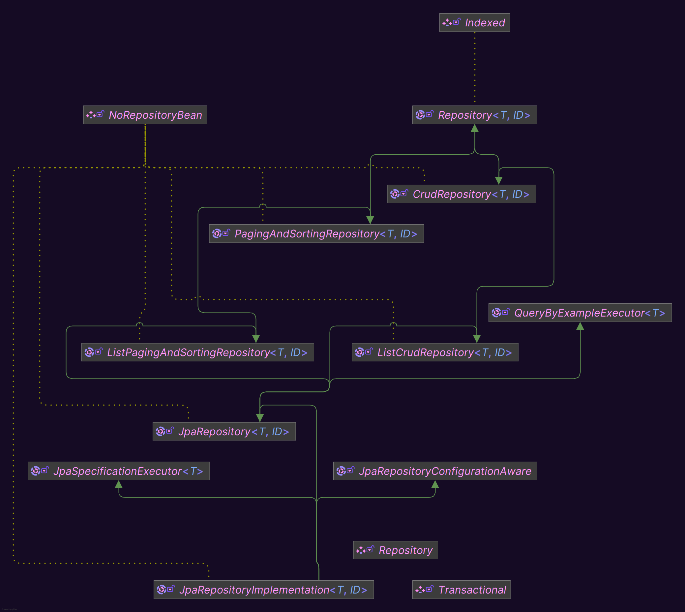
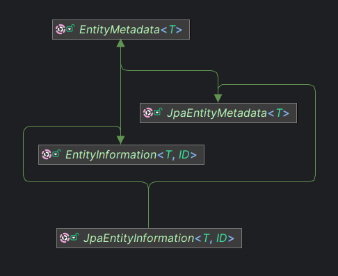
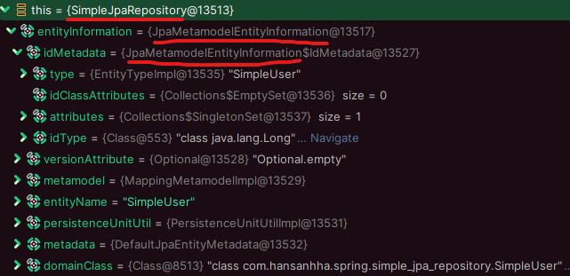
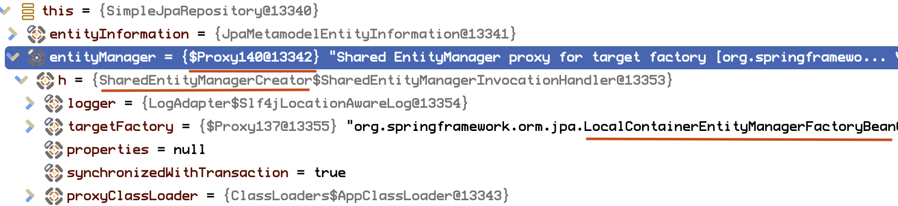
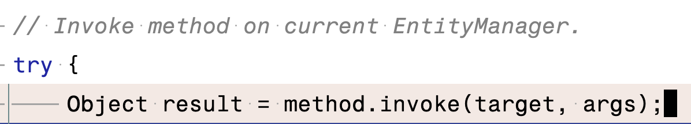
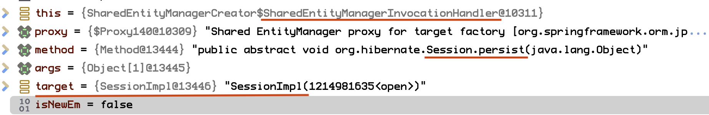

[Spring Data JPA](#spring-data-jpa)

[JpaRepository<T, ID>](#jparepositoryt-id)

[JpaRepositoryImplementation<T, ID>](#jparepositoryimplementationt-id)

[SimpleJpaRepository](#simplejparepository)
- [상속 관계](#simplejparepository-상속-관계)
- [코드 분석](#simplejparepository-코드-분석)
  - [필드](#필드)
  - [메서드](#메서드)
    - [공통](#공통)
    - [조회](#조회)
    - [저장](#저장)
    - [삭제](#삭제)

[리포지토리 인터페이스 자동 구현(SimpleJpaRepository 생성) 및 프록시 패턴 적용](#리포지토리-인터페이스-자동-구현simplejparepository-생성-및-프록시-패턴-적용)

[엔티티 ID 생성 전략에 따른 ID 값과 SQL 실행 시점 결정](#엔티티-ID-생성-전략에-따른-ID-값과-SQL-실행-시점-결정)

## Spring Data JPA

스프링 데이터의 하위 프로젝트로, JPA 데이터 접근을 추상화하여 스프링 데이터 접근 계층에서

Hibernate, EclipseLink 등 JPA 프로바이더를 손쉽게 사용할 수 있음

주요 기능

- Repository 인터페이스 제공
- 메서드 이름 기반의 쿼리 생성
- 페이징 및 정렬 지원
- JPQL 및 네이티브 쿼리 지원
- 동적 쿼리 지원
- Auditing 기능 제공

## JpaRepository<T, ID>

스프링 데이터 JPA에서 추가적인 기능을 제공하는 리포지토리 인터페이스

```java

@NoRepositoryBean
public interface JpaRepository<T, ID> extends ListCrudRepository<T, ID>, ListPagingAndSortingRepository<T, ID>, QueryByExampleExecutor<T> {
    /*
        EntityManager의 변경 사항을 데이터베이스에 강제로 동기화(flush)함
        현재까지의 변경 사항을 즉시 데이터베이스에 반영하고 싶을 때 사용
     */
    void flush();

    // 주어진 엔티티를 저장한 후, 즉시 데이터베이스에 동기화함
    <S extends T> S saveAndFlush(S entity);

    <S extends T> List<S> saveAllAndFlush(Iterable<S> entities);

    /** @deprecated */
    @Deprecated
    default void deleteInBatch(Iterable<T> entities) {
        this.deleteAllInBatch(entities);
    }

    /*
        주어진 엔티티들을 배치로 삭제함
        삭제된 엔티티를 1차 캐시(영속성 컨텍스트)에서 제거하지 않으며, 성능을 위해 데이터베이스에 직접 삭제 명령을 보냄
        대량의 엔티티를 한 번에 삭제하고자 할 때 사용
     */
    void deleteAllInBatch(Iterable<T> entities);

    // ID 컬렉션을 기반으로 배치 삭제
    void deleteAllByIdInBatch(Iterable<ID> ids);

    // 데이터베이스의 모든 엔티티들을 배치로 삭제
    void deleteAllInBatch();

    /** @deprecated */
    @Deprecated
    T getOne(ID id);

    /** @deprecated */
    @Deprecated
    T getById(ID id);

    /*
        주어진 ID에 대한 엔티티의 지연 로딩(Lazy Loading) 참조를 반환함
        데이터베이스 조회를 지연시키고, 엔티티의 참조를 즉시 반환해야 할 때 사용됨
        getOne(), getById() 메서드를 대체함
     */
    T getReferenceById(ID id);

    /*
        Query By Example(QBE) 기능을 사용하여 특정 조건에 맞는 엔티티를 검색하는 메서드
        Example은 엔티티의 예제 인스턴스로, 일치 조건 여부 동적 쿼리를 생성할 때 사용됨 
     */
    <S extends T> List<S> findAll(Example<S> example);

    // 정렬 조건 추가, 지정된 정렬 순서에 따라 결과를 정렬함
    <S extends T> List<S> findAll(Example<S> example, Sort sort);
}
```

## JpaRepositoryImplementation<T, ID>

SimpleJpaRepository가 구현하는 인터페이스로, 스프링 데이터 JPA가 런타임에 Repository 인터페이스를 실제 구현체로 생성할 때 필요한 내부 기능을 정의함

```java
/*
  JpaSpecificationExecutor: 동적 쿼리를 생성 및 실행
  JpaRepositoryConfigurationAware: 스프링 데이터 JPA 내부에서 리포지토리를 설정하는 데 사용됨
 */
@NoRepositoryBean
public interface JpaRepositoryImplementation<T, ID> extends JpaRepository<T, ID>, JpaSpecificationExecutor<T>, JpaRepositoryConfigurationAware {
}
```

## SimpleJpaRepository

스프링 데이터 JPA에서 사용자가 리포지토리 인터페이스를 정의할 때 기본적으로 제공되는 구현체

어떤 리포지토리 인터페이스(`Repository` `CrudRepository` `JpaRepository`)를 확장하든 이 클래스가 구현됨

### SimpleJpaRepository 상속 관계



JpaRepositoryImplementation 인터페이스 및 그 상위 인터페이스를 모두 구현하고 있음

JPA를 사용하여 데이터베이스와 상호작용하는 데 필요한 대부분의 표준 메서드들을 구현함

- CRUD 작업
- 페이징
- 정렬
- flush, deleteInBatch() 등

```java

@Repository // @Repository 어노테이션 적용
@Transactional( // @Transactional(readOnly) 어노테이션 적용
        readOnly = true
)
public class SimpleJpaRepository<T, ID> implements JpaRepositoryImplementation<T, ID> {
    ...
}
```

### SimpleJpaRepository 코드 분석

#### 필드

SimpleJpaRepository의 모든 필드

```java
@Repository
@Transactional(readOnly = true)
public class SimpleJpaRepository<T, ID> implements JpaRepositoryImplementation<T, ID> {
    private static final String ID_MUST_NOT_BE_NULL = "The given id must not be null";
    
    // 해당 SimpleJpaRepository가 취급하는 JPA 엔티티에 대한 메타데이터 정보를 관리함
    private final JpaEntityInformation<T, ?> entityInformation ;
    
    // 
    private final EntityManager entityManager;
    private final PersistenceProvider provider;

    private @Nullable CrudMethodMetadata metadata;
    private @Nullable ProjectionFactory projectionFactory;
    private EscapeCharacter escapeCharacter = EscapeCharacter.DEFAULT;

    // ...
}
```

##### `JpaEntityInformation<T, ?> entityInformation` 필드



JPA 엔티티에 대한 메타데이터 정보를 관리하는 역할을 하는 인터페이스임

엔티티 클래스에 대한 다양한 정보를 추상화하여, 엔티티의 식별자(ID) 및 관련 메타데이터를 추출하고 관리하는 데 사용됨

주요 기능

- 엔티티 메타데이터 접근
  - 데이터 접근 계층에서 엔티티와 상호작용할 때 사용하는 정보
  - 엔티티의 클래스 타입, ID 속성, 버전 속성
- 엔티티 ID 정보 제공
  - 엔티티의 식별자 필드(기본 키)에 대한 정보 제공
  - ID 필드 이름, 타입, 값 등
- 엔티티 상태 정보 제공
  - 특정 엔티티 인스턴스가 새로 생성된 건지, 이미 존재하는 건지 확인할 수 있는 메서드 제공

JpaEntityInformation 타입으로 주입되는 실제 구현체는 `JpaMetaModelEntityInformation` 클래스임



- JPA의 Metamodel API를 통해 엔티티의 메타데이터를 동적으로 분석하여 제공
- 복합 키를 지원하며, 복합 키의 각 속성에 대한 정보 관리

엔티티가 새로 생성된 엔티티(데이터베이스에 저장되지 않은 상태)인지 판단할 때 JpaEntityInformation의 `isNew` 메서드를 사용함

###### JpaEntityInformation.isNew()

```java
@Override
public boolean isNew(T entity) {

    /*
        1. 버전 속성 존재 여부와 원시 타입 검사
        
        JPA 엔티티의 버전 속성(versionAttribute)은 엔티티 병합(merge) 충돌 감지용으로 사용되는 Optional 객체임
        
        만약 엔티티에 버전 속성이 없거나(versionAttribute.isEmpty()) 
        버전 속성이 존재하지만, 해당 데이터 타입이 원시 타입(primitive type)인 경우 부모 클래스(AbstractEntityInformation)의 isNew()를 호출함
     */
    if (versionAttribute.isEmpty()
            || versionAttribute.map(Attribute::getJavaType).map(Class::isPrimitive).orElse(false)) {
        return super.isNew(entity);
    }

    /*
        2. 버전 속성 존재 시 null 검사
        
        DirectFieldAccessFallbackBeanWrapper는 Spring의 BeanWrapper 인터페이스 구현체로 객체의 필드에 직접 접근하여 값을 읽고 쓸 수 있게 함
        엔티티 객체의 속성 값을 읽어오기 위해 사용함
     */
    BeanWrapper wrapper = new DirectFieldAccessFallbackBeanWrapper(entity);

    /*
        엔티티의 버전 속성 값이 null이면 엔티티가 데이터베이스에 저장되지 않는 것으로 판단
        null이 아니면 이미 데이터베이스에 저장된 것으로 판단하고 false를 반환
     */
    return versionAttribute.map(it -> wrapper.getPropertyValue(it.getName()) == null).orElse(true);
}
```

###### AbstractEntityInformation.isNew()

```java
public abstract class AbstractEntityInformation<T, ID> implements EntityInformation<T, ID> {

    public boolean isNew(T entity) {

        // 엔티티 객체의 식별자 필드(ID)와 식별자 필드의 타입을 추출함
        ID id = getId(entity);
        Class<ID> idType = getIdType();

        // 해당 필드가 객체 타입이라면 식별자 필드의 값이 null인 경우에 새 엔티티로 판단함
        // getId(entity)에서 null이 아닌 값을 반환하면 실제로는 새 엔티티(아직 DB 저장 X)라고 하더라도 이미 존재하는 엔티티라고 판단함
        if (!idType.isPrimitive()) {
            return id == null;
        }

        // ID 필드가 Number 타입인 경우 값이 0인지에 따라 새소 생성된 엔티티인지 판단
        if (id instanceof Number) {
            return ((Number) id).longValue() == 0L;
        }

        throw new IllegalArgumentException(String.format("Unsupported primitive id type %s", idType));
    }
}
```

###### SimpleJpaRepository의 JpaEntityInformation 필드 사용

- JPA 연산(save, delete) 등을 수행할 때 엔티티 상태와 메타데이터를 확인하기 위해 사용함
- ```java
  @Override
  @Transactional
  public <S extends T> S save(S entity) {

      Assert.notNull(entity, "Entity must not be null");

      // 새로 생성된 엔티티 경우 persist를 호출하여 데이터베이스에 저장
      if (entityInformation.isNew(entity)) {
          entityManager.persist(entity);
          return entity;
      } else { 
          // 기존 엔티티인 경우 merge를 호출하여 병합
          /* 
            주의점
          - JpaEntityInformation의 isNew는 엔티티의 식별자 필드가 객체 타입인 경우 null 여부로 새 엔티티인지 판단함
          - 새 엔티티임에도 불구하고 getId(entity)에서 null을 반환하지 않는다면 merge(entity)를 호출함
          */ 
          return entityManager.merge(entity);
      }
  }
  ```
- 복합 키를 가진 엔티티의 경우에도 JpaEntityInformation을 통해 올바르게 ID를 추출하고 관련 작업 수행함

##### EntityManager entityManager

JPA는 자바 진영의 표준 퍼시스턴스 API 명세이고 실제 구현은  Hibernate ORM이나 EcliipseLink 등의 JPA 프로바이더가 제공함

스프링 데이터 JPA는 스프링 환경에서 JPA를 보다 쉽게 사용할 수 있도록 추상화한 스프링 데이터 하위 모듈로, SimpleJpaRepository는 개발자가 인터페이스만 작성해도 DB와 기본적인 CRUD를 상호작용할 수 있도록 하는 객체임

[EntityManager](./jpa.md#entitymanager)(SessionImpl)는 SimpleJpaRepository 내에서 영속성 컨텍스트와 상호작용을 담당하는 핵심 객체로 엔티티 저장/업데이트, JPQL 쿼리 실행, 트랜잭션 관리 등의 작업을 수행함

SimpleJpaRepository는 두 개의 생성자를 가지고 있는데, 모두 EntityManager를 외부에서 주입받음
```java
public SimpleJpaRepository(JpaEntityInformation<T, ?> entityInformation, EntityManager entityManager) {

    Assert.notNull(entityInformation, "JpaEntityInformation must not be null");
    Assert.notNull(entityManager, "EntityManager must not be null");

    this.entityInformation = entityInformation;
    this.entityManager = entityManager;
    this.provider = PersistenceProvider.fromEntityManager(entityManager);
}
    
public SimpleJpaRepository(Class<T> domainClass, EntityManager entityManager) {
    this(JpaEntityInformationSupport.getEntityInformation(domainClass, entityManager), entityManager);
}
```

###### SimpleJpaRepository에게 EntityManager를 주입하는 과정

JpaRepositoryFactory는

EntityManagerFactory 생성
- JPA 설정 파일(persistence.xml) 또는 스프링 JPA 설정(Java Config, application.properties)에서 JPA 구현체와 데이터베이스 연결 정보가 설정됨
- 스프링 데이터 JPA는 엔티티 매니저를 생성하는 EntityManagerFactory(SessionFactory)의 값을 설정하고 관리하기 위해 LocalContainerEntityManagerFactoryBean 객체를 사용함
  - 스프링 부트 환경에선 JPA 자동 구성을 담당하는 HibernateJpaAutoConfiguration(JpaBaseConfiguration) 객체가 자동으로 LocalContainerEntityManagerFactoryBean을 빈으로 등록함
- 여러 트랜잭션과 스레드 간 엔티티 매니저 팩토리가 안전하게 공유될 수 있도록 LocalContainerEntityManagerFactoryBean은 EntityManagerFactory에 프록시를 적용함

EntityManager 생성
- EntityManagerFactory로부터 생성된 EntityManager는 SimpleJpaRepository에 주입되는데, SimpleJpaRepository는 특정 리포지토리 인터페이스의 구현체로 여러 스레드에서 사용됨
- 스프링은 멀티 스레드 환경을 위해 리포지토리 인터페이스 프록시로 SimpleJpaRepository를 동작시키는 것처럼 EntityManager 역시 프록시 패턴을 사용하여 엔티티 매니저를 관리함
- 즉 EntityManager의 프록시가 실제 인스턴스를 대신하여 SimpleJpaRepository에 주입되고, 트랜잭션의 시작과 종료 시점에 맞춰 실제 EntityManager 인스턴스를 제공하거나 해제하여 트랜잭션 단위로 엔티티 매니저를 사용할 수 있도록 함
- 트랜잭션 범위 내에서 프록시로 감싸진 EntityManager를 동적으로 바인딩하고 해제하는 역할을 `SharedEntityManagerCreator`가 하는데, 트랜잭션이 시작될 때마다 새로운 EntityManager 인스턴스를 가져오거나, 현재 트랜잭션에 바인딩된 EntityManager를 반환함



SimpleJpaRepository의 EntityManager 필드 사용
- ```java
  @Override
  @Transactional
  public <S extends T> S save(S entity) {

    Assert.notNull(entity, "Entity must not be null");

    // 새로운 엔티티인 경우 persist 호출
    if (entityInformation.isNew(entity)) {
        entityManager.persist(entity);
        return entity;
    } else { // 아닌 경우 merge 호출
        return entityManager.merge(entity);
    }
  }
  ```
- `entityManager.persist`를 호출하면 실제론 SharedEntityManagerCreator의 중첩 클래스인 SharedEntityManagerInvocationHandler에서 호출을 가로채서 현재 트랜잭션에 바인딩된 실제 엔티티 매니저의 구현체(SessionImpl)에게 위임함
- 엔티티 매니저가 없는 경우 새로운 EntityManager를 생성해줌
- 
- 

##### PersistenceProvider provider

PersistenceProvider는 JPA의 특정 구현체(provider)와 관련된 기능을 추상화하여 제공하는 enum 클래스임

JPA는 하이버네이트, 이클립스링크같이 여러 구현체가 존재하며, 각 구현체마다 차이가 있을 수 있음

PersistenceProvider는 특정 구현체에서 제공하는 특화된 기능(표준 JPA API에서 제공하지 않는 기능)을 사용할 수 있도록 함

SimpleJpaRepository에서의 사용
- 카운트 쿼리를 실행하는 count() 메서드에서 각 JPA 구현체별로 카운트 쿼리 스트링이 다를 수 있기 때문에 PersistenceProvider를 통해 카운트 쿼리를 완성함
- ```java
  private String getCountQueryString() {
  
      String countQuery = String.format(COUNT_QUERY_STRING, provider.getCountQueryPlaceholder(), "%s");
      return getQueryString(countQuery, entityInformation.getEntityName());
  }
  
  public enum PersistenceProvider implements QueryExtractor, ProxyIdAccessor, QueryComment {
  
    // 하이버네이트의 경우 '*'을 리턴함
    HIBERNATE(...)  {
      @Override
      public String getCountQueryPlaceholder() {
          return "*";
      }
    }
  }
  ```

##### CrudMethodMetadata metadata

CrudMethodMetadata는 스프링 데이터 JPA 내부에서 사용되는 인터페이스로, 쿼리 힌트(Query Hint)와 잠금 모드(LockModeType) 같은 JPA 리포지토리 메서드와 관련된 메타데이터를 제공함

쿼리 성능 최적화나 동시성 제어를 목적으로 CrudMethodMetadata를 사용함

쿼리 힌트는 특정 JPA 구현체에서 최적화나 특정 기능을 활성하기 위해 사용할 수 있는 힌트이고

잠금 모드는 JPA에서 엔티티를 조회할 때 사용할 잠금 전략을 지정할 수 있음
- 비관적 잠금 (Pessimistic Locking)
- 낙관적 잠금 (Optimistic Locking)

리포지토리 메서드가 실행될 때 CrudMethodMetadata가 제공한 쿼리 힌트나 잠금 모드를 기반으로 EntityManager가 쿼리를 실행함

SimpleJpaRepository에서의 사용
- SimpleJpaRepository의 CrudMethodMetadata는 선택적으로 사용할 수 있는 `@Nullable` 필드임
- findById() 메서드에서 CrudMethodMetadata가 있는 경우 지정된 메타데이터를 활용하여 엔티티를 조회함
- ```java
  @Override
  public Optional<T> findById(ID id) {

      Assert.notNull(id, ID_MUST_NOT_BE_NULL);

      Class<T> domainType = getDomainClass();

      // CrudMethodMetadata 필드가 없는 경우, 일반 조회
      if (metadata == null) {
          return Optional.ofNullable(entityManager.find(domainType, id));
      }

      // CrudMethodMetadata가 있는 경우 잠금 모드와 쿼리 힌트를 가져온 후, 엔티티 조회
      LockModeType type = metadata.getLockModeType();
      Map<String, Object> hints = getHints();

      return Optional.ofNullable(
              type == null ? entityManager.find(domainType, id, hints) : entityManager.find(domainType, id, type, hints));
  }
  ```

##### ProjectionFactory projectionFactory

ProjectionFactory는 스프링 데이터 JPA에서 프로젝션(projection) 인스턴스를 생성하는 인터페이스임

프로젝션은 JPA의 쿼리 결과에서 특정 필드들만 선택적으로 가져와서 특정 데이터 형식(인터페이스나 클래스)에 매핑하여 반환하는 기능으로

두 가지 유형으로 나뉨
- 클로즈드 프로젝션 (Closed Projection)
  - 프로젝션 인터페이스에 정의된 getter를 통해 쿼리 결과 매핑
  - ```java
      // name 필드만 조회하는 프로젝션
      public interface UserNameProjection {
          String getName();
      }
      ```
- 오픈 프로젝션 (Open Projection)
  - 복잡한 표현식을 포함한 프로젝션
  - ```java
      public interface UserSummary {
          String getName();
    
          @Value("#{target.name + ' ' + target.lastName}")
          String getFullName();
      }
      ```

프로젝션 팩토리가 주어진 프로젝션 타입의 인스턴스를 생성하고

스프링 데이터 JPA는 쿼리 결과를 자동으로 해당 인스턴스에 매핑하여 반환함

ProjectionFactory는 CrudMethodMetadata와 마찬가지로 `@Nullable`이 적용된 필드임

##### EscapeCharacter escapeCharacter = EscapeCharacter.DEFAULT

EscapeCharacter는 JPA 쿼리 중 와일드카드 문자나 특수 문자를 처리할 때 사용하는 이스케이프 문자를 나타냄

LIKE 쿼리의 `%`, `_` 같은 특수문자 처리가 필요한 경우 사용됨

#### 메서드

##### 공통

###### `T getReferenceById(ID)`

`EntityManager.getReference(Class<T> entityClass, Object primaryKey)` 메서드를 호출하여 지정된 ID에 대한 엔티티의 레퍼런스(프록시)를 반환하는 JpaRepository 인터페이스 구현 메서드임

성능을 최적화하기 위해 엔티티를 즉시 로딩하지 않고, 데이터베이스 조회를 연기시키는 **지연 로딩 방식(프록시 반환)**으로 가져옴

반환된 프록시 객체는 실제로 해당 엔티티 필드가 접근되기 전까지 데이터베이스에서 엔티티 데이터를 로드하지 않음

```java
@Override
public T getReferenceById(ID id) {

    Assert.notNull(id, ID_MUST_NOT_BE_NULL);
    return entityManager.getReference(getDomainClass(), id);
}
```

###### `Class<T> getDomainClass()`

JpaEntityInformation(AbstractEntityInformation)을 통해 엔티티 객체의 클래스 타입을 반환함

```java
protected Class<T> getDomainClass() {
    return entityInformation.getJavaType();
}
```

###### `TypedQuery<T> getQuery(Specification<T>, Sort)`

현재 엔티티 객체의 타입 정보를 추출하여 `getQuery(Specification<T>, Class<S>, Sort)` 메서드에게 위임함

```java
protected TypedQuery<T> getQuery(@Nullable Specification<T> spec, Sort sort) {
    return getQuery(spec, getDomainClass(), sort);
}
```

###### `<S extends T> TypedQuery<S> getQuery(Specification<T>, Class<S>, Sort)`

JPA Criteria API를 사용하여 동적 쿼리(TypedQuery)를 생성하는 메서드임

[Specification](#specification)으로 쿼리 조건을 동적으로 적용하고, Sort로 결과를 정렬함

```java
protected <S extends T> TypedQuery<S> getQuery(@Nullable Specification<S> spec, Class<S> domainClass, Sort sort) {

    // 엔티티 매니저로부터 Criteria 쿼리 빌더 획득 
    CriteriaBuilder builder = entityManager.getCriteriaBuilder();
    // 쿼리를 표현하는 객체 생성, 반환 타입이 <S>인 쿼리를 생성함
    CriteriaQuery<S> query = builder.createQuery(domainClass);
  
    /*
        생성된 쿼리에 주어진 Specification (조건) 할당
        쿼리의 루트 엔티티를 나타내는 Root<S> 객체 반환 (엔티티의 필드/속성에 접근할 수 있는 쿼리의 루트)
     */
    Root<S> root = applySpecificationToCriteria(spec, domainClass, query);
    /*
        쿼리의 SELECT절 설정, 쿼리의 결과로 전체 엔티티(root)를 선택하도록 설정함
        applySpecificationToCriteria는 WHERE절 조건/조인만 설정하고, 쿼리의 SELECT절은 정의하지 않기 때문에 명시적으로 해줘야됨 
     */
    query.select(root);

    // 주어진 정렬 조건이 있는 정렬 적용
    if (sort.isSorted()) {
        query.orderBy(toOrders(sort, root, builder));
    }
  
    /*
        entityManager.createQuery(query): 엔티티 매니저를 통해 TypedQuery 생성
        applyRepositoryMethodMetadata(TypedQuery): 리포지토리 메서드에 정의된 추가 메타데이터(쿼리 힌트, 잠금 모드) 적용
     */
    return applyRepositoryMethodMetadata(entityManager.createQuery(query));
}
```

###### `void flush()`

본래 영속성 컨텍스트는 트랜잭션 커밋 후 데이터베이스에 내용을 반영하지만,

엔티티 매니저의 flush()는 **트랜잭션을 종료하지 않고** 현재 영속성 컨텍스트의 내용을 데이터베이스에 즉시 반영함(동기화)

```java
@Override
@Transactional
public void flush() {
    entityManager.flush();
}
```

##### 조회

###### `Optional<T> findById(ID)`

리포지토리 인터페이스에 지정한 ID를 기반으로 한 개의 엔티티를 조회하는 CrudRepository 인터페이스 구현 메서드

```java
@Override
public Optional<T> findById(ID id) {

    Assert.notNull(id, ID_MUST_NOT_BE_NULL);

    // 엔티티 타입 추출
    Class<T> domainType = getDomainClass();

    // 메타데이터가 없는 경우 일반 조회
    if (metadata == null) {
        return Optional.ofNullable(entityManager.find(domainType, id));
    }

    // 있는 경우 잠금 모드와 쿼리 힌트 추출
    LockModeType type = metadata.getLockModeType();
    Map<String, Object> hints = getHints();

    // 잠금 모드와 쿼리 힌트를 사용한 엔티티 조회
    return Optional.ofNullable(
            type == null ? entityManager.find(domainType, id, hints) : entityManager.find(domainType, id, type, hints));
}
```

###### `List<T> findAllById(Iterable<ID>)`

리포지토리 인터페이스에 지정한 ID를 기반으로 여러 개의 엔티티를 조회하는 ListCrudRepository 인터페이스 구현 메서드

엔티티의 기본 키 유형(복합 키, 단일 키)에 따라 동작 방식이 다름
- 복합 키인 경우: 주어진 ID 값들로 개별 조회 수행
- 단일 키인 경우: 단일 쿼리로 여러 엔티티 조회

```java
@Override
public List<T> findAllById(Iterable<ID> ids) {

    // 예외 메시지 대신 직접 String 값을 사용함
    Assert.notNull(ids, "Ids must not be null");

    // 주어진 ID 값들이 비어있는 경우 메서드를 실행하지 않고 빈 컬렉션 반환
    if (!ids.iterator().hasNext()) {
        return Collections.emptyList();
    }

    /*
        엔티티의 식별자 필드가 복합 키로 구성된 경우
        루프문을 돌아서 findById()를 호출해서 각 ID에 대해 개별적으로 엔티티를 조회하여 결과를 누적한 뒤 반환
        복합 키를 단일 쿼리로 여러 엔티티를 조회하는 게 복잡하기 때문에 개별 조회 수행
     */
    if (entityInformation.hasCompositeId()) {

        List<T> results = new ArrayList<>();

        for (ID id : ids) {
            findById(id).ifPresent(results::add);
        }

        return results;
    }

    /*
        단일 기본 키인 경우 여러 ID에 대한 단일 쿼리(IN절)를 동적으로 생성해서 엔티티들을 조회함
     */
    Collection<ID> idCollection = toCollection(ids);

    // 여러 아이디에 대한 IN절 쿼리 조건 생성 
    ByIdsSpecification<T> specification = new ByIdsSpecification<>(entityInformation);
    // 동적 쿼리 생성
    TypedQuery<T> query = getQuery(specification, Sort.unsorted());

    // 쿼리에 idCollection 바인딩 후 실행 및 결과 반환
    return query.setParameter(specification.parameter, idCollection).getResultList();
}
```

###### `List<T> findAll()`

쿼리 조건, 정렬을 지정하지 않고 모든 엔티티 조회하는 ListCrudRepository 인터페이스 구현 메서드

```java
@Override
public List<T> findAll() {
    // Specification 전달 X
    return getQuery(null, Sort.unsorted()).getResultList();
}
```

###### `List<T> findAll(Pageable)`

페이징과 정렬을 지원하는 방식으로 엔티티를 조회하는 PagingAndSortingRepository 인터페이스 구현 메서드임

데이터베이스에서 특정 페이지의 데이터만 조회함 - 메모리 사용량을 줄임

주어진 pageable이 페이징 조건이 지정된 경우 `findAll(Specification<T>, Pageable)` 메서드에 위임함

```java
@Override
public Page<T> findAll(Pageable pageable) {

    if (pageable.isUnpaged()) {
        return new PageImpl<>(findAll());
    }

    // findAll(Specification<T>, Pageable) 위임
    return findAll((Specification<T>) null, pageable);
}
```

`findAll(Specification<T>, Pageable)` 메서드는 주어진 specfication과 pageable을 토대로 TypedQuery를 생성하고

페이징 조건이 지정되지 않은 경우 쿼리를 실행하여 결과를 반환하고, 지정된 경우 `readPage(TypedQuery<S>, final Class<S>, Pageable, Specification<S>)` 메서드에 위임함

```java
@Override
public Page<T> findAll(@Nullable Specification<T> spec, Pageable pageable) {

    // 쿼리 생성
    TypedQuery<T> query = getQuery(spec, pageable);
    
    // readPage(TypedQuery<S>, final Class<S>, Pageable, Specification<S>)
    return pageable.isUnpaged() ? new PageImpl<>(query.getResultList())
            : readPage(query, getDomainClass(), pageable, spec);
}
```

readPage 메서드는 주어진 pageable로부터 쿼리의 limit와 offset을 설정하고

조회 쿼리와 카운트 쿼리를 실행함

```java
protected <S extends T> Page<S> readPage(TypedQuery<S> query, final Class<S> domainClass, Pageable pageable,
        @Nullable Specification<S> spec) {

    // offset, limit 설정
    if (pageable.isPaged()) {
        query.setFirstResult(PageableUtils.getOffsetAsInteger(pageable));
        query.setMaxResults(pageable.getPageSize());
    }

    // 조회 쿼리, 카운트 쿼리 실행
    return PageableExecutionUtils.getPage(query.getResultList(), pageable,
            () -> executeCountQuery(getCountQuery(spec, domainClass)));
}

// 카운트 쿼리
private static long executeCountQuery(TypedQuery<Long> query) {

    Assert.notNull(query, "TypedQuery must not be null");

    List<Long> totals = query.getResultList();
    long total = 0L;

    for (Long element : totals) {
        total += element == null ? 0 : element;
    }

    return total;
}
```

##### 저장

###### `<S extends T> S save(T entity)`

엔티티 객체를 영속(persist, 데이터베이스에 저장) 또는 병합(merge, 데이터베이스에 업데이트)하는 CrudRepository 인터페이스 구현 메서드

새 엔티티 판단 로직 참고 [entityInformation.isNew(entity)](#jpaentityinformationisnew)

persist 시 기본 키 생성 전략에 따라 INSERT 쿼리 실행 시점이 다름 [참고](#엔티티-id-생성-전략과-save-메서드-동작-관계)

```java
@Override
// 스프링 프레임워크의 @Transactional 적용
@Transactional
public <S extends T> S save(S entity) {

    Assert.notNull(entity, "Entity must not be null");

    /*
        아직 데이터베이스에 저장되지 않은 새로운 엔티티인 경우
        영속성 컨텍스트에 추가하고, 트랜잭션이 커밋될 때 INSERT 쿼리 실행 후 엔티티 반환
     */
    if (entityInformation.isNew(entity)) {
        entityManager.persist(entity);
        return entity;
        /*
            이미 존재하는 엔티티인 경우 병합 수행 
            엔티티의 상태를 영속성 컨텍스트와 동기화하고 트랜잭션이 커밋될 때 UPDATE 쿼리를 실행하여 엔티티 변경 사항 반영
         */
    } else {
        return entityManager.merge(entity);
    }
}
```

###### `<S extends T> List<S> saveAll(Iterable<S> entities)`

여러 개의 엔티티 객체를 받아서 영속 또는 병합하는 ListCrudRepository 인터페이스 구현 메서드

```java
@Override
@Transactional
public <S extends T> List<S> saveAll(Iterable<S> entities) {

    Assert.notNull(entities, "Entities must not be null");

    List<S> result = new ArrayList<>();

    // 루프문을 돌면서 save(T) 메서드 위임
    for (S entity : entities) {
        result.add(save(entity));
    }

    return result;
}
````

###### `<S extends T> S saveAndFlush(S entity)`

엔티티 객체를 저장하는 save() 호출 후, 바로 데이터베이스에 변경사항을 반영하는 [flush()](#flush) 메서드를 호출하는 JpaRepository 인터페이스 구현 메서드

saveAllAndFlush() 메서드도 마찬가지로, saveAll() 호출 후 flush 메서드를 호출함

```java
@Override
@Transactional
public <S extends T> S saveAndFlush(S entity) {

    S result = save(entity);
    flush();

    return result;
}
```

##### 삭제

###### `void delete(T)`

엔티티 객체를 영속성 컨텍스트에서 삭제하는 CrudRepository 인터페이스 구현 메서드

영속성 컨텍스트의 엔티티 존재 여부에 따른 처리 방식
- 새 엔티티인 경우: 삭제 X
- 영속성 컨텍스트에 포함된 경우(영속 상태인 경우): 삭제
- 영속성 컨텍스트에 포함되지 않은 경우(영속 상태가 아닌 경우): `entityManager.find()`를 사용하여 DB에서 엔티티 조회하여 영속 상태로 만든 후 삭제

```java
@Override
@Transactional
@SuppressWarnings("unchecked")
public void delete(T entity) {

    Assert.notNull(entity, "Entity must not be null");

    // 새 엔티티인 경우 삭제 X
    if (entityInformation.isNew(entity)) {
        return;
    }

    // 영속성 컨텍스트에 포함된 엔티티인 경우 삭제
    if (entityManager.contains(entity)) {
        entityManager.remove(entity);
        return;
    }

    Class<?> type = ProxyUtils.getUserClass(entity);

    /*
        데이터베이스에서 조회하여 영속 상태로 만듦
        해당 엔티티를 찾은 경우에 삭제 
     */
    T existing = (T) entityManager.find(type, entityInformation.getId(entity));
    if (existing != null) {
        entityManager.remove(entityManager.merge(entity));
    }
}
```

###### `void deleteAll()`

[findAll()](#listt-findall) 메서드를 통해 모든 엔티티를 영속성 컨텍스트에 올린 다음 루프문을 돌면서 전부 전부 삭제하는 메서드

```java
@Override
@Transactional
public void deleteAll() {

    for (T element : findAll()) {
        delete(element);
    }
}
```

###### `void deleteById(ID)`

findById()로 엔티티 조회 후, 존재하면 삭제하는 CrudRepository 인터페이스 구현 메서드

```java
@Override
@Transactional
public void deleteById(ID id) {

    Assert.notNull(id, ID_MUST_NOT_BE_NULL);

    findById(id).ifPresent(this::delete);
}
```

###### `deleteAllById(Iterable<? extends ID>`

루프문을 돌아 `deleteById(ID)` 호출하는 CrudRepository 인터페이스 구현 메서드

```java
@Override
@Transactional
public void deleteAllById(Iterable<? extends ID> ids) {

    Assert.notNull(ids, "Ids must not be null");

    for (ID id : ids) {
        deleteById(id);
    }
}
```

###### `void deleteAllInBatch()`

영속성 컨텍스트를 사용하지 않고 즉시 한 번의 배치 쿼리로 데이터베이스에서 직접 삭제하는 JpaRepository 인터페이스 구현 메서드

[deleteAll()](#void-deleteall) 메서드와 달리 영속성 컨텍스트와 엔티티 상태와 관계없이 작동함

영속성 컨텍스트를 사용하지 않기 때문에 메모리 사용량이 적어서 대량 데이터 삭제에 적합함

또한 삭제된 엔티티들은 영속성 컨텍스트에 반영되지 않기 때문에, 이후 영속성 컨텍스트가 새로 생성되기 전까지 엔티티의 상태와 데이터베이스의 상태가 일치하지 않을 수 있음

```java
@Override
@Transactional
public void deleteAllInBatch() {

    // DELETE FROM '엔티티명' 쿼리 생성
    Query query = entityManager.createQuery(getDeleteAllQueryString());

    applyQueryHints(query);

    query.executeUpdate();
}
```

###### `deleteAllByIdInBatch(Iterable<ID>)`

[deleteAllInBatch](#void-deleteallinbatch)와 마찬가지로 영속성 컨텍스트나 엔티티의 상태와 상관없이, 주어진 ID값에 해당하는 엔티티를 데이터베이스에서 직접 삭제하는 JpaRepository 인터페이스 구현 메서드

```java
@Override
@Transactional
public void deleteAllByIdInBatch(Iterable<ID> ids) {

    Assert.notNull(ids, "Ids must not be null");

    if (!ids.iterator().hasNext()) {
        return;
    }

    if (entityInformation.hasCompositeId()) {

        List<T> entities = new ArrayList<>();
        // 주어진 id값에 대한 엔티티 객체(프록시)들을 담아서 deleteAllByIdInBatch(Iterable<ID> ids) 호출
        ids.forEach(id -> entities.add(getReferenceById(id)));
        deleteAllInBatch(entities);
    } else {

        // DELETE FROM '엔티티명' WHERE '엔티티 ID명' IN 'ID 값' 쿼리 생성
        String queryString = String.format(DELETE_ALL_QUERY_BY_ID_STRING, entityInformation.getEntityName(),
                entityInformation.getIdAttribute().getName());

        Query query = entityManager.createQuery(queryString);

        // 주어진 ids 값에 대한 쿼리 파라미터 설정 
        Collection<ID> idCollection = toCollection(ids);
        query.setParameter("ids", idCollection);

        applyQueryHints(query);

        query.executeUpdate();
    }
}
```

###### `void deleteAllInBatch(Iterable<T>)`

주어진 엔티티에 대해 영속성 컨텍스트를 무시하고 데이터베이스에서 직접 엔티티들을 삭제하는 JpaRepository 인터페이스 구현 메서드

```java
@Override
@Transactional
public void deleteAllInBatch(Iterable<T> entities) {

    Assert.notNull(entities, "Entities must not be null");

    if (!entities.iterator().hasNext()) {
        return;
    }

    applyAndBind(getQueryString(DELETE_ALL_QUERY_STRING, entityInformation.getEntityName()), entities, entityManager)
            .executeUpdate();
}
```

## 리포지토리 인터페이스 자동 구현(SimpleJpaRepository 생성) 및 프록시 패턴 적용

### 1. 리포지토리 인터페이스 정의

Repository 인터페이스를 확장한 리포지토리 인터페이스 정의

```java
  public interface UserRepository extends JpaRepository<User, Long> {
    List<User> findByLastName(String lastName);
  }
```

### 2. 스프링 부트 자동 구성, 프록시 패턴 적용

스프링 부트 애플리케이션이 구동되면서 [HibernateJpaAutoConfiguration](../txt/spring%20data%20jpa%20autoconfiguration.md#hibernatejpaautoconfiguration), [JpaRepositoriesAutoConfiguration](../txt/spring%20data%20jpa%20autoconfiguration.md#jparepositoriesautoconfiguration) 자동 구성 활성화

- 모든 리포지토리 인터페이스 스캔(`@EnableJpaRepositories` 어노테이션이 설정된 패키지)
- 스캔된 각 리포지토리 인터페이스마다 **프록시 구현체** 생성 및 스프링 빈 등록
- 또한 [JpaRepositoryFactory](https://docs.spring.io/spring-data/jpa/docs/current/api/org/springframework/data/jpa/repository/support/JpaRepositoryFactory.html)를 사용하여 각각의 엔티티에 대한 리포지토리 인터페이스 기본 구현체인 SimpleJpaRepository를 생성함

예시
- ProductRepository, OrderRepository에 대해 각각 프록시 생성
- JpaRepositoryFactory -> 각각의 엔티티(Product, Order)에 대해 SimpleJpaRepository 인스턴스 생성
- ProductRepostiory 프록시 -> `SimpleJpaRepository<Product, Long>` 인스턴스 사용
- OrderRepository 프록시 -> `SimpleJpaRepository<Order, Long>` 인스턴스 사용

#### 프록시 구현체 동작 방식

프록시 구현체는 리포지토리 인터페이스의 메서드를 구현하는데, 내부적으로 메서드 호출을 상황에 따라 적절하게 위임하는 진입점 역할을 함

todo 수정 필요

- 기본 CRUD 메서드 호출 -> SimpleJpaRepository에게 위임 -> SimpleJpaRepository는 EntityManager를 통해 DB 작업 수행
- 메서드명 기반 쿼리(메서드명 파싱을 통해 동적으로 JPQL 쿼리 생성) 호출 -> `JpaQueryMethodFactory`를 통해 메서드명 기반 쿼리 파악 ->  `PartTree`를 통해 키워드 분석 후 JPQL 생성 -> EntityManager를 통해 DB 작업 수행
- 사용자 정의 쿼리(`@Query`) 호출 -> `JpaQueryMethodFactory`를 통해 커스텀 `@Query` 기반 쿼리 파악 -> `@Query` 내용을 EntityManager에게 전달하여 DB 작업 수행, 메서드 파라미터를 `@Query`에 바인딩
- 커스텀 구현체의 메서드 호출 -> 해당 구현체에게 위임

### 3. 의존성 주입

```java
@Service
@Transactional
public class UserService {

  private final UserRepository userRepository;

  // 스프링 부트 자동 구성에 의해 생성된 UserRepository 타입의 프록시 객체 주입
  public UserService(UserRepository userRepository) {
    this.userRepository = userRepository;
  }
}
```

## 엔티티 ID 생성 전략에 따른 ID 값과 SQL 실행 시점 결정

새로운 엔티티를 저장하려고 entity.persit() 메서드를 호출하면 엔티티는 영속성 컨텍스트에 추가됨

이 때 엔티티의 ID 생성 전략에 따라 ID 값 결정과 쿼리 실행 시점이 다름

JPA의 ID 생성 전략
- GenerationType.IDENTITY (특정 벤더에 의존하는 방식)
  - 기본 키 생성을 DB에게 위임하는 전략
  - 엔티티를 영속성 컨텍스트에 추가한 후 INSERT 쿼리가 실제로 실행되기 전까지 ID가 설정되지 않음
  - 영속성 컨텍스트는 무조건 ID 속성이 있어야 하므로, 이 전략을 사용하면 `persist()` 호출 시 트랜잭션 커밋과 상관없이 곧바로 INSERT 쿼리를 수행함
- GenerationType.SEQUENCE (특정 벤더에 의존하는 방식)
  - 데이터베이스 시퀀스를 사용하여 ID를 생성하는 전략
  - `persist()` 메서드 호출 시점에 JPA에서 데이터베이스 시퀀스 값을 먼저 조회하여 ID 값을 설정함
  - ID가 INSERT 쿼리 실행전에 결정되며, INSERT 쿼리는 트랜잭션이 커밋될 때 수행됨
  - 시퀀스를 생성하는 어노테이션이 필요함
  - ```java
      @Table(name="users")
      @Entity
      @SequenceGenerator ( // 시퀀스 생성
          name="USERS_SEQ_GENERATOR",
          sequenceName="USERS_SEQ"
      )
      public class User {
          
          @Id
          @GeneratedValue(strategy = GenerationType.SEQUENCE)
          private Long id;
      }
      ```
- GenerationType.UUID
  - 기본 키로 UUID를 사용하는 전략
- GenerationType.TABLE (특정 벤더에 독립적인 방식)
  - 시퀀스 테이블 흉내내서 ID를 관리하는 전략
  - 특정 벤더에 의존적이지 않은 방식이지만 별도의 시퀀스 테이블을 만들고 관리해야 함
  - INSERT 쿼리 실행 전에 ID 값이 결정될 수 있음
  - ```java
      @Entity
      public class User {
          @GeneratedValue(strategy = GenerationType.TABLE, generator = "USERS_SEQ_GENERATOR")
          @TableGenerator(
              name = "USERS_SEQ_GENERATOR",
              table = "USERS_SEQUENCE",
              pkColumnName = "sequence_name",
              pckColumnValue = "USERS_SEQ"
          )
          private Long id;
      }
      ```
- GenerationType.AUTO (엔티티 ID 생성 기본 전략)
  - JPA 구현체가 자동으로 선택하도록 하는 전략(데이터베이스 벤더에 따라 결정됨)
  - MySQL: GenerationType.AUTO (AUTO_INCREMENT)
  - PostgreSQL: GenerationType.SEQUENCE
  - Oracle: GenerationType. SEQUENCE

## Projections

## Locking

## Auditing

## Custom Repository

## Publishing Domain Events

## Repository Return type