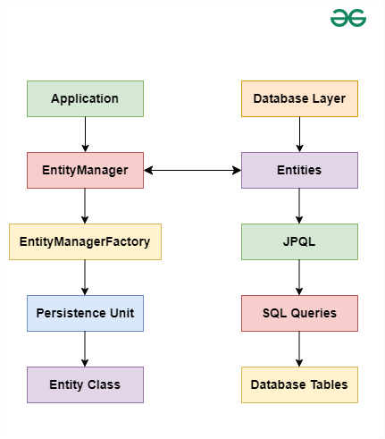

[JPA](#jpa)
- [패러다임 불일치](#패러다임-불일치)
- [ORM](#orm)
- [JPA 아키텍처](#jpa-아키텍처)
- [영속성 컨텍스트와 엔티티](#영속성-컨텍스트와-엔티티)
  - [엔티티 상태 관리](#엔티티-상태-관리)
  - [변경 감지 (Dirty Checking)](#변경-감지-dirty-checking)
  - [쓰기 지연 (Write-Behind)](#쓰기-지연-write-behind)
  - [엔티티 동일성 보장](#엔티티-동일성-보장)
- [트랜잭션에 따른 영속성 컨텍스트 생명주기](#트랜잭션에-따른-영속성-컨텍스트-생명주기)

[jakarta.persistence](#jakartapersistence)
- [엔티티 정의 및 매핑 관련 어노테이션](#엔티티-정의-및-매핑-관련-어노테이션)
- [관계 매핑 관련 어노테이션](#관계-매핑-관련-어노테이션)
- [영속성 관리와 캐싱 관련 어노테이션 및 인터페이스](#영속성-관리와-캐싱-관련-어노테이션-및-인터페이스)
- [쿼리 관련 어노테이션 및 인터페이스](#쿼리-관련-어노테이션-및-인터페이스)
- [콜백 메서드 및 이벤트 리스너 관련 어노테이션](#콜백-메서드-및-이벤트-리스너-관련-어노테이션)
- [기타 인터페이스 및 어노테이션](#기타-인터페이스-및-어노테이션)

## JPA

JPA(Java Persistence API)는 자바 애플리케이션에서 객체 지향 프로그래밍과 관계형 데이터베이스 간의 패러다임 불일치 문제를 해결하기 위한 표준 명세임

패러다임 불일치는 객체 지향 언어에서 사용하는 객체 모델과 관계형 데이터베이스에서 사용하는 테이블 모델 간의 차이에서 비롯됨

### 패러다임 불일치

다음과 같은 패러다임 불일치가 발생함

**객체와 테이블의 불일치**

자바에서는 데이터를 오브젝트로 표현하고

관계형 데이터베이스에서는 데이터를 테이블을 사용해서 저장함

객체는 필드와 메서드를 가지는 반면, 테이블은 행과 열로 데이터를 관리함

**상속**

자바에서는 객체 상속, 확장을 통해 코드의 재사용성을 높일 수 있지만

관계형 데이터베이스에서는 상속 개념이 없어서 테이블 구조로 표현하기 어려움

**연관관계**

자바 객체 사이에는 참조(Association), 집합(Composition), 상속(Inheritance) 등의 관계가 있는 반면,

관계형 데이터베이스에서는 이러한 관계를 외래 키나 조인으로 처리해야 됨

**객체 식별**

객체는 메모리에서 유일한 참조를 통해 식별되지만, 데이터베이스에서는 기본 키를 사용하여 식별함

### ORM

패러다임 불일치를 해결하기 위해, 자바 코드로 데이터베이스의 퍼시스턴스(영속성) 작업을 처리할 수 있도록 도와주는 **ORM(Object-Relational Mapping)** 기술이 JPA임

ORM은 객체 지향 모델을 관계형 데이터베이스 테이블로 매핑하는 작업을 의미함

**객체와 테이블 매핑**

JPA는 자바 객체를 데이터베이스 테이블에 매핑하여, 자바 코드로 데이터베이스의 데이터를 쉽게 다룰 수 있도록 함

자바 클래스 - 데이터베이스의 테이블

필드 - 테이블 컬럼

**CURD 기능**

JPA를 통해 자바 코드로 데이터베이스의 CRUD 작업을 쉽게 수행 가능

**캐싱**

JPA는 1차 캐시 등을 통해 데이터베이스 접근을 줄이고 성능을 향상 시킴

**트랜잭션 관리**

데이터베이스 트랜잭션을 자바 코드로 관리할 수 있게 해줌

**JPQL**

JPA는 SQL이 아닌, 객체 지향적으로 데이터를 질의할 수 있는 JPQL(Java Persistence Query Language)을 제공함

이를 통해 자바 코드에서 직접 SQL을 작성하지 않고도 데이터베이스와 상호작용을 할 수 있음

### JPA 아키텍처

엔티티 매니저는 개발자가 직접 상호작용하는 API로 영속성 컨텍스트를 관리하는 객체임

엔티티의 생명 주기를 관리하고 데이터베이스와의 CRUD 작업을 수행함

하나의 엔티티 매니저는 하나의 영속성 컨텍스트를 가짐

즉, 엔티티 매니저가 생성될 때 내부적으로 영속성 컨텍스트도 함께 생성됨

### 영속성 컨텍스트와 엔티티

특정 EntityManager가 관리하는 엔티티 객체들의 모임을 영속성 컨텍스트라고 함

메모리 상에 존재하는 엔티티 객체를 관리하는 일종의 캐시임

**주요 기능**
- 특정 트랜잭션 내에서 관련된 모든 엔티티 객체의 상태 추적(엔티티 객체가 언제 추가되거나 수정되었는지, 삭제되었는지 파악)
- 데이터베이스와 동기화 작업 수행
- 변경 감지
- 엔티티 객체의 삽입(persist), 수정(merge), 삭제(remove), 조회(find) 작업 관리
- 쓰기 지연
- 엔티티 동일성 보장

#### 엔티티 상태 관리

엔티티의 상태를 크게 네 가지로 구분해서 관리함

##### 비영속(new/transient)

영속성 컨텍스트가 관리하지 않는 상태로, 데이터베이스와 연관되지 않은 상태

##### 영속(managed)

영속성 컨텍스트가 관리하는 상태로, 데이터베이스와 연관되어 있음

##### 준영속(detached)

한 때 영속 상태였지만, 현재는 영속성 컨텍스트와의 연관이 끊어진 상태

##### 삭제(removed)

영속성 컨텍스트에 의해 삭제가 예약된 상태

#### 변경 감지 (Dirty Checking)

영속성 컨텍스트는 관리 중인 엔티티의 상태 변화를 추적함

엔티티의 속성 값이 변경되면 이를 감지하고, 트랜잭션이 커밋될 때 자동으로 데이터베이스에 반영함

#### 쓰기 지연 (Write-Behind)

JPA는 엔티티의 변경 작업을 즉시 데이터베이스에 반영하지 않고, 트랜잭션이 커밋되는 시점에 한꺼번에 처리하는 방식으로 최적화를 함

이를 쓰기 지연이라고 하는데, 이를 통해 여러 변경 작업을 하나의 SQL로 묶어 실행할 수 있어 성능을 높임

#### 엔티티 동일성 보장

영속성 컨텍스트는 동일한 트랜잭션 내에서 같은 데이터베이스 레코드를 참조하는 경우, 동일한 엔티티 객체를 반환함

이를 통해 엔티티 객체의 동일성을 보장하고, 데이터의 일관성을 유지할 수 있음

### 트랜잭션에 따른 영속성 컨텍스트 생명주기

영속성 컨텍스트는 보통 트랜잭션 단위로 관리됨

#### 트랜잭션 시작 시

트랜잭션이 시작되면 엔티티 매니저가 활성화되고, 이와 함께 영속성 컨텍스트도 초기화됨

엔티티 매니저는 영속성 컨텍스트를 통해 엔티티를 관리함

#### 엔티티 관리

트랜잭션이 진행되는 동안 엔티티 매니저를 사용해 엔티티를 조회하거나 수정할 수 있음

이 때 조회된 엔티티는 영속성 컨텍스트에 저장되고, 이후 동일한 트랜잭션 내에서 다시 조회되면 데이터베이스에서 가져오는 대신 영속성 컨텍스트에서 반환됨

#### 변경 감지와 쓰기 지연

트랜잭션이 진행되는 동안, 영속성 컨텍스트는 엔티티의 상태 변화를 감지함

에닡티가 변경되면, 트랜잭션이 커밋될 때까지 변경 사항을 영속성 컨텍스트에 보관하고 커밋 시점에 한 번에 데이터베이스 반영함

#### 트랜잭션 커밋 시

트랜잭션이 커밋되면 영속성 컨텍스트에 있는 모든 변경 사항이 데이터베이스에 반영함

#### 트랜잭션 롤백 시

트랜잭션이 롤백되면 영속성 컨텍스트에 있는 모든 변경 사항이 무효화됨

영속성 컨텍스트에 있떤 엔티티의 상태를 초기 상태로 복원함

#### 트랜잭션 종료 후

트랜잭션이 종료되면, 영속성 컨텍스트는 비워지거나 폐기됨

엔티티 매니저는 더 이상 이전의 영속성 컨텍스트를 사용할 수 없으며, 새로운 트랜잭션이 시작되면 새로운 영속성 컨텍스트가 생성됨

## jakarta.persistence

JPA 표준 명세를 제공하는 핵심 패키지로, JPA 기능을 사용하기 위한 여러 가지 어노테이션과 인터페이스를 포함함

### 엔티티 정의 및 매핑 관련 어노테이션

`@Entity`: 클래스가 JPA 엔티티임을 나타내며 데이터베이스의 테이블과 매핑됨

`@Table`: 엔티티 클래스가 매핑될 데이터베이스 테이블을 지정함 (테이블 이름, 스키마 등 지정)

`@Id`: 엔티티의 기본 키를 나타내며 데이터베이스의 기본 키에 해당하는 필드에 적용됨

`@GeneratedValue`: 기본 키 생성 전략을 지정함
- `GenerationType`: 기본 키 생성 전략 유형(TABLE, SEQUENCE, IDENTITY, UUID, AUTO)

`@Column`: 엔티티 필드가 데이터베이스의 컬럼에 매핑됨을 나타냄 (컬럼의 이름, 길이, 널 여부 등 지정)

`@Embedded`: 임베디드 타입 클래스를 정의할 때 사용됨

`@Embeddable`: 임베디드 타입 클래스를 엔티티 필드에 선언할 때 사용됨

`@MappedSuperclass`: 공통적으로 사용하는 매핑 정보를 상속하기 위한 슈퍼 클래스임을 나타냄, 직접 테이블과 매핑되지 않지만 이를 상속받는 서브 클래스들이 테이블과 매핑됨

`@Inheritance`: 엔티티 상속 전략을 지정함
- `InheritanceType`: 엔티티 상속 전략 유형(SINGLE_TABLE, TABLE_PER_CLASS, JOINED)

`@Enumerated`: Enum 타입을 데이터베이스에 저장할 떄 사용됨 (ORDINAL, STRING 방식 중 선택)

`@Lob`: 대형 객체(Large Object) 타입을 매핑할 때 사용됨, BLOG(Binary Large Object) 또는 CLOB(Character Large Object)로 저장됨

`@Transient`: 특정 필드를 영속성 컨텍스트에 포함하지 않도록 지정함, 데이터베이스 컬럼으로 매핑되지 않음

### 관계 매핑 관련 어노테이션

`@ManyToOne`: 다대일 관계 매핑

`@OneToMany`: 일대다 관계 매핑

`@ManyToMany`: 다대다 관계 매핑

`@JoinTable`: 다대다 관계에서 조인 테이블을 정의할 때 사용

`@JoinColumn`: 외래 키 매핑, 관계를 정의하는 필드에 적용함

`@CascadeType`: 관계 엔티티에서 영속성 전이(cascade)를 정의할 때 사용(ALL, PERSIST, MERGE, REMOVE, REFRESH, DETACH)

### 영속성 관리와 캐싱 관련 어노테이션 및 인터페이스

#### EntityManager

JPA의 핵심 인터페이스로, 데이터베이스 관리 및 엔티티 객체의 생명주기를 관리함

엔티티 매니저 인스턴스는 엔티티의 상태를 관리하는 일종의 1차 캐시로 동작하는 영속성 컨텍스트와 연결됨

데이터베이스와 동기화하거나 엔티티의 상태 변화를 추적하며 다음과 같은 주요 기능을 수행함
- 엔티티 저장, 조회 수정, 삭제 작업
- JPQL 또는 네이티브 SQL을 사용한 쿼리 실행
- 트랜잭션 관리(`EntityTransaction`)

#### EntityManagerFactory

EntityManager 인스턴스를 생성하는 인터페이스로, 데이터베이스와의 상호작용을 관리하며 엔티티 매니저의 생명 주기를 제어함

애플리케이션에서 엔티티 매니저가 필요할 때마다 엔티티 매니저 팩토리를 통해 생성함

엔티티 매니저 팩토리는 애플리케이션 전체에서 하나만 생성되어야 함

**주요 역할**
- 엔티티 매니저 관리
- 캐시 관리: 2차 캐시 관리, 여러 엔티티 매니저가 공유할 수 있는 글로벌 캐시 제공
- 리소스 관리: 애플리케이션 종료 시 데이터베이스 연결, 캐시 등과 같은 리소스를 정리함

#### Persistence

EntityManagerFactory를 생성하기 위한 유틸리티 클래스임

persistence.xml 파일에 정의된 영속성 유닛의 이름을 통해 엔티티 매니저 팩토리를 생성함

#### @PersistenceContext

영속성 컨텍스트를 관리하는 데 사용됨 (엔티티 매니저를 주입할 때 사용됨)

#### EntityTransaction

JPA에서 트랜잭션을 관리하기 위한 인터페이스임

`@Cacheable`: 엔티티가 2차 캐시를 사용할 수 있음을 나타냄 (엔티티를 캐시할지 여부 결정)

`@Cache`: 캐시의 속성 정의 (캐시를 사용하는 방법과 캐시 속성 정의)

### 쿼리 관련 어노테이션 및 인터페이스

`@NamedQuery`: 이름이 지정된 정적 쿼리를 정의함, 엔티티 클래스에 미리 정의된 JPQL 쿼리를 사용할 수 있음

`@NamedQueries`: 여러 개의 이름이 지정된 쿼리를 정의할 때 사용됨

#### Query

일반적인 JPQL 쿼리 인터페이스로 JPQL 또는 네이티브 SQL을 사용해 데이터베이스의 다양한 쿼리를 실행할 수 있음

엔티티 매니저를 통해 생성됨

#### TypedQuery

타입이 지정된 쿼리(타입 세이프)를 실행할 때 사용되는 인터페이스로 제네릭을 지원함

결과를 특정 타입으로 받을 수 있음

`@QueryHint`: 쿼리 실행에 대한 힌드 제공, 성능 최적화나 캐시 사용 여부 등을 정의할 수 있음

### 콜백 메서드 및 이벤트 리스너 관련 어노테이션

`@PrePersist`: 엔티티가 저장되기 전에 호출될 메서드에 선언함

`@PostPersist`: 엔티티가 저장된 후에 호출될 메서드에 선언함

`@PreUpdate`: 엔티티가 업데이트되기 전에 호출될 메서드에 선언함

`@PostUpdate`: 엔티티가 업데이트된 후에 호출될 메서드에 선언함

`@PreRemove`: 엔티티가 삭제되기 전에 호출될 메서드에 선언함

`@PostRemove`: 엔티티가 삭제된 후에 호출될 메서드에 선언함

`@PostLoad`: 엔티티가 로드된 후에 호출될 메서드에 선언함

### 기타 인터페이스 및 어노테이션

#### LockModeType

엔티티에 대한 락 모드를 정의함
- READ
- WRITE
- OPTIMISTIC
- OPTIMISTIC_FORCE_INCREMENT
- PESSIMISTIC_READ
- PESSIMISTIC_WRITE
- PESSIMISTIC_FORCE_INCREMENT
- NONE

#### FlushModeType

영속성 컨텍스트의 플러시 모드를 설정함
- AUTO
- COMMIT

